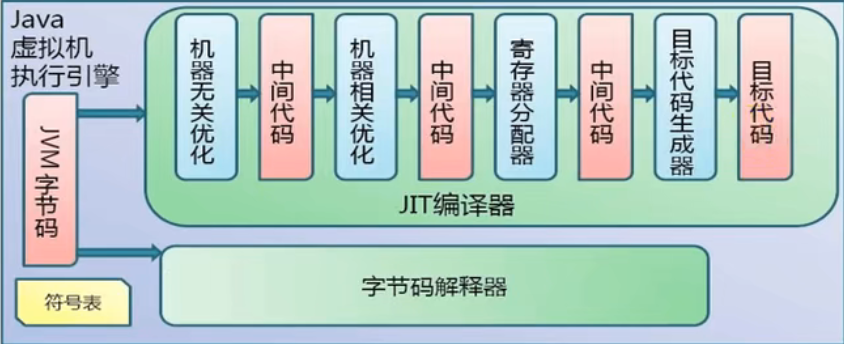
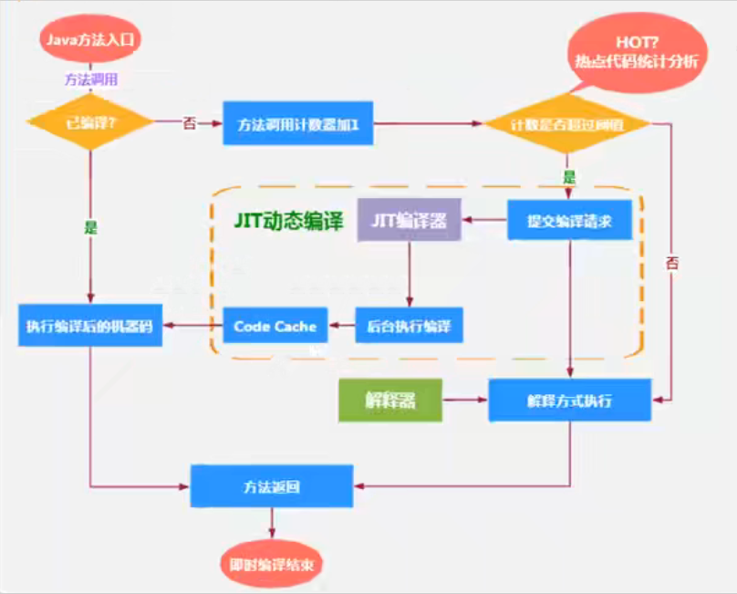

# 执行引擎

## 概述

- 执行引擎是 Java 虚拟机核心的组成部分之一。
- `虚拟机` 是一个相对于 `物理机`  的概念，这两种机器都有代码执行能力，其区别是物理机的执行引擎是直接建立在处理器、缓存  、指令集和操作系统层面上的，而**虚拟机的执行引擎是由软件自行实现的** ， 因此可以不受物理条件制约地定制指令集与执行引擎的结构体系，**能够执行那些不被硬件直接支持地指令集格式**
- JVM 的主要任务是负责 **装载字节码到其内部**，字节码并不能够直接运行在操作系统之上，因为字节码指令并非等价于本地及其指令，它内部包含的仅仅知识一些能够被 JVM 所识别的字节码指令、符号集，以及其他辅助信息。
- 那么，如果想要让一个 Java 程序运行起来，执行引擎（Execution Engine）的任务就是 **将字节码指令解释/编译为对应平台上的本地及其指令才可以。**简单来说，JVM的执行引擎充当了将高级语言翻译为机器语言的译者

## 执行引擎工作过程

1. 执行引擎在执行的过程中究竟需要执行什么样的字节码指令完全依赖于 `PC 寄存器`。

2. 每当执行完一项指令操作后，PC 寄存器就会更新下一条需要被执行的指令地址。

3. 在方法执行的过程中，执行引擎有可能会通过存储在局部变量表中的对象引用准确定位到存储在 Java 堆区中的对象实例信息，以及通过对象头中的元数据指针定位到目标对象的类型信息

   

   从外观上来看，所有的 Java 虚拟机的执行引擎输入、输出都是一致的：输入的是字节码二进制流，处理过程是字节码解析执行的等效过程，输出的是执行结果。 

## Java代码编译和执行的过程

​	大部分的程序代码转换成物理机的目标代码或虚拟机能执行的指令集之前，都需要经过上图几个步骤

- `橙色过程` 由 javac 即前端编译器执行完成
- `绿色过程` 是解释过程
- `蓝色过程` 是编译过程

> java语言是半编译，半解释型语言

​	Java 字节码的执行是由 JVM 执行引擎来完成，流程图如下所示

**什么是解释器（Interpreter），什么是 JIT 编译器**

- `解释器`： 当 Java 虚拟机启动时会根据预定义的规范 **对字节码采用逐行解释的方式执行**，将每套字节码文件中的内容 `翻译` 为对应平台的本地机器指令执行。
- `JIT（Just In Time Compiler）编译器`：就是虚拟机将源代码直接编译成和本地机器平台相关的机器语言。

**字节码**

- 字节码是一种 中间状态（中间码）的二进制代码（文件），它比机器码更抽象，需要直译器转译后才能成为机器码
- 字节码主要是为了实现特定软件运行和软件环境、与硬件环境无关。
- 字节码的实现方式是通过编译器和虚拟机器。编译器将源码编译成字节码，特定平台上的虚拟机器将字节码转译为可直接执行的指令
  - 字节码的典型应用为 Java Bytecode

## 解释器

​	JVM 设计者们的初衷仅仅只是单纯地**为了满足 Java 程序实现跨平台特性**，因此避免采用静态编译的方式直接生成本地机器指令，从而诞生了实现解释器在运行时采用逐行解释字节码执行程序的想法。

- 解释器真正意义上所承担的角色就是一个运行时 `翻译者`, 将字节码文件中的内容 `翻译` 为对应平台的本地机器指令执行。
- 当一条字节码指令被解释执行完成后，接着再根据 PC 寄存器中记录的下一套需要被执行的字节码指令执行解释操作

​	在 Java 的发展历史里，一共有两套解释执行器，即古老的 `字节码解释器`、现在普遍使用的 `模板解释器`。

- 字节码解释器在执行时通过 `纯软件代码` 模拟字节码的执行，效率非常低下
- 模板解释器将 **每一条字节码和一个模板函数相关联**， 模板函数中直接产生这条字节码执行时的机器码，从而很大程度上提高了解释器的性能
- 在 HotSpot VM 中，解释器主要由 Interpreter 模块和 Code 模块构成
  - Interpreter 模块：实现了解释器的核心功能
  - Code 模块：用于管理 HotSpot VM 在运行时生成的本地机器指令   

**现状**

- 由于解释器的设计和实现上非常简单，因此除了 Java 语言之外，还有许多高级语言同样也是基于解释器执行的，比如 Python、Perl、Ruby等。但是在今天，**基于解释器执行已经沦落为低效的代名词**，并且时常被一些 C/C++ 程序员所调侃。
- 为了解决这个问题，JVM平台支持一种叫做即时编译器的技术。即使编译的目的是避免函数被解释执行，而是 **将整个函数体编译成为机器码，每次函数执行时，只执行编译后的机器码即可**，这种方式可以使执行效率大幅度提升。
- 不过无论如何，基于解释器的执行模式仍然为中间语言的发展做出了不可磨灭的贡献。

## JIT 编译器

​	HotSpot VM 是目前市面上高性能虚拟机的代表作之一。它**采用解释器与即时编译器并存的架构**。在 Java虚拟机运行时，解释器和即时编译器能够相互协作，各自取长补短，尽力去选择最合适的方式去权衡编译本地代码的时间和直接解释执行代码的时间

概念解释：

- Java 语言的 `编译期` 其实是一段 `不确定` 的操作过程，因为他可能是指一个前端编译器（编译器的前端）把 .java 转变成 .class文件的过程
- 也可能是指虚拟机的**后端运行期编译器**（JIT 编译器）把字节码转变成机器码的过程。
- 也可能是使用 **静态提前编译器**（AOT编译器）直接把 Java 文件编译成本地代码的过程

---

​	**既然 HotSpot VM 中已经内置了 JIT 编译器了，那么为什么还需要使用解释器来 `拖累` 程序的执行性能呢？**比如 JRockit VM内部就不包含解释器，字节码全部依靠即使编译器编译后执行。

首先明确：

​	当程序启动后，解释器可以马上发挥作用，省去编译的时间，立即执行。编译器要想发挥作用，把代码编译成本地代码，需要一定的执行时间。但编译为本地代码后，执行效率更高。

所以：

​	尽管 JRockit VM 中程序的执行性能会非常高效，但程序再启动时必然需要花费更长的时间来进行编译。对于服务端应用来说，启动时间并非是关注重点，但对于那些看重启动时间的应用场景而言，或许就需要采用解释器与即使编译器并存的架构来换取一个平衡点。在此模式下，**当 Java 虚拟器启动时，解释器可以首先发挥作用，而不必等待及时编译器全部编译完成后再执行，这样可以省去许多不必要的编译时间。随着时间的推移，编译器发挥作用，把越来越多的代码编译成本地代码，获得更高的执行效率**

​	同时，解释执行在编译器及逆行激进优化不成立的时候，作为编译器的 `逃生门`。

### 热点代码及探测方式

​	是否需要启动 JIT 编译器将字节码直接编译为对应平台的本地机器指令，则需要根据代码被调用 `执行的频率` 而定。关于那些需要被编译为本地代码的字节码，也被称之为 `热点代码`， JIT 编译器在运行时会针对那些频繁被调用的 `热点代码` 做出 `深度优化`，将其直接编译为对应平台的本地机器指令，以此提升 Java 程序的执行性能。 

- 一个被多次调用的方法，或者时一个方法体内部循环次数较多的循环体都可以被称之为 `热点代码`， 因此都可以通过 JIT 编译器编译为本地机器指令。由于这种编译方式发生在方法的执行过程中，因此也被称之为 `栈上替换`，或简称为 **OSR（On Stack Replcement）**编译。
- 一个方法究竟**要别调用多少次**，或者一个循环体究竟需要执行多少次循环才可以达到这个标准？必然需要一个明确的阈值，JIT编译器才会将这些 `热点代码` 编译为本地机器指令执行。 这里主要依靠`热点探测功能`。
- **目前 HotSpot VM 所采用的热点探测方式是基于计数器的热点探测** 
- 采用基于计数器的热点探测，HotSpot VM 将会为每一个方法都建立 2 个不同类型的计数器，分别为 `方法调用计数器（Invocation Center）` 和 `回边计数器（Back Edge Counter）`。
  - 方法调用计数器用于统计方法的调用次数
  - 回边计数器则用于统计循环体执行的循环次数

#### 方法调用计数器

- 这个计数器就用于统计方法被调用的次数，它的默认阈值在 Client 模式下是 1500 次， 在 Server 模式下是 10000 次。超过这个阈值，就会触发 JIT 编译。

- 这个阈值可以通过虚拟机参数 `-XX:CompileThreshold` 来认为设定

- 当一个方法被调用时，会先检查该方法是否存在被 JIT 编译过的版本，如果存在，则优先使用编译后的本地代码来执行。如果不存在已经被编译过的版本，则将此方法的调用计数器值 + 1，然后**判断方法调用计数器与回边计数器之和是否已经超过方法调用计数器的阈值**。如果已经超过阈值，那么将会向即时编译器提交一个该方法的代码编译请求

  

#### 回边计数器

​	它的作用是统计一个方法中 **循环体代码执行的次数**， 在字节码中遇到控制流向后跳转的指令称为 `回边（Back Edge）`。显然，建立回边计数器统计的目的就是为了触发 OSR 编译。

### HotSpot JVM的执行方式

​	当虚拟机启动的时候，**解释器可以首先发挥作用**，而不必等待即使编译器全部编译完成再执行，这样可以**省去许多不必要的编译时间**。并且程序运行时间的推移，及时编译逐渐发挥作用，根据热点探测功能，**将有价值的字节码编译为本地机器指令**，以换取更高的程序执行效率。

​	缺省情况下 HotSpot VM是采用解释器与即时编译器并存的架构，当然开发人员可以根据具体的应用场景，通过命令显式地为 Java 虚拟机指定在运行时到底是 完全采用解释器 执行，还是 完全采用即时编译器 执行。如下所示：

- `-Xinit`: 完全采用解释器模式执行程序；
- `-Xcomp`：完全采用及时编译器模式执行程序。如果及时编译器出现问题，解释器会介入执行
- `-Xmixed`: 采用解释器 + 即时编译器地混合模式共同执行程序

​	在 HotSpot VM 中内嵌有两个 JIT 编译器，分别为 Client Compiler 和 Server Compiler，但大多数情况下我们简称为 `c1编译器` 和 `c2编译器`。开发人员可以通过如下命令显式指定 Java 虚拟机在运行时到底使用哪一种即时编译器，如下所示：

- `-client`: 指定 Java 虚拟机运行在 Client 模式下，并使用 c1编译器；
  - c1编译器会对字节码进行**简单和可靠的优化，耗时短**。以达到更快的编译速度。
- `-server`: 指定 Java 虚拟机运行在 Server 模式下，并使用 c2编译器。
  - c2进行 **耗时较长的优化，以及激进优化**。但优化的代码执行效率更高。

**c1 和 c2 编译器不同的优化策略**

在不同的编译器上有不同的优化策略

- c1 编译器上主要有 方法内联、去虚拟化、冗余消除等
  - `方法内联`：将引用的函数代码编译到引用点处，这样可以减少栈帧的生成，减少参数传递以及跳转过程。
  - `去虚拟化`：对唯一的实现类进行内联
  - `冗余消除`：在运行期间把一些不会执行的代码折叠掉

- c2 的优化主要是在全局层面，逃逸分析是优化的基础。基于逃逸分析在 c2 上有如下几种优化：
  - `标量替换`：用标量值代替聚合对象的属性值
  - `栈上分配`：对于未逃逸的对象分配在栈而不是堆
  - `同步消除`：清除同步操作，通常指 synchronized

​	`分层编译（Tiered Compilation）策略`：程序解释执行（不开启性能监控）可以触发 c1 编译，将字节码编译成机器码，可以进行简单优化，也可以加上性能监控，c2 编译会根据性能监控信息进行激进优化。

​	不过在 Java7 版本之后，一旦开发人员在程序中显示指定命令 `-server` 时，默认将会开启分层编译策略，由 c1 编译器和 c2 编译器相互写作共同来执行编译任务。

**总结：**

- 一般来讲，JIT 编译出来的机器码性能比解释器高。
- c2 编译器启动时长比 c1 编译器慢，系统稳定执行以后，c2 编译器执行速度远远快于 c1 编译器。

### Graal编译器

处于试验阶段，需要通过开关参数：`-XX:+UnlockExperimentalVMOptions -XX:+UseJVMCICompiler` 去激活，才可以使用  

### AOT编译器

- jdk9引入了 静态提前编译器，Ahaead of Time Compiler

- Java 9 引入了实验性 AOT 编译工具 jaotc 它借助了 Graal 编译器，将所输入的 Java 类文件转换为机器码，并存放至生成的动态共享库中

- 所谓 AOT 编译，是与即时编译相对立的一个概念。我们知道，即时编译指定是在**程序的运行过程中**，将字节码转换未可在硬件上直接运行的机器码，并部署至托管环境中的过程。而 AOT 编译指的是，在 程序运行之前，便将字节码转换为机器码的过程