---
category:
- JVM 
  
title: 运行时数据区
excerpt: Java虚拟机定义了若干程序运行期间会使用到的运行时数据区，其中有一些会随着虚拟机启动而创建，随着虚拟机退出而销毁。另外一些则是与线程一一对应的，这些与线程对应的数据区域会随着线程开始和结束而创建和销毁
---
# 运行时数据区

## 运行时数据区概述及线程

- 不同的JVM对于内存的划分方式和管理机制存在着部分差异

  > 内存是非常重要的系统资源，是硬盘和 CPU 的中间仓库及桥梁，承载着操作系统和以供用程序的实时运行。JVM内存布局规定了Java在运行过程中内存申请、分配、管理的策略，保证了JVM的高效稳定运行。**不同的JVM对于内存的划分方式和管理机制存在着部分差异**。

- Java虚拟机定义了若干程序运行期间会使用到的运行时数据区，其中有一些会随着虚拟机启动而创建，随着虚拟机退出而销毁。另外一些则是与线程一一对应的，这些与线程对应的数据区域会随着线程开始和结束而创建和销毁


### 线程

- 虚拟机线程

  ​	这种线程的操作是血药JVM达到安全点才会出现，这些操作必须在不同的线程中发生的原因实他们都需要JVM达到安全点，这样堆才不会变化。赭红线程的执行类型包括“stop-the-world”的垃圾收集，线程栈收集，线程挂起以及偏向锁撤销

- 周期任务线程

  ​	这种线程是时间周期时间的体现（比如中断），他们一般用于周期性操作的调度执行

- GC线程

  ​	这种线程对在JVM里不同种类的垃圾收集行为提供了支持。	

- 编译线程

  ​	这种线程在运行是会将字节码编译成到本地代码

- 信号调度线程

  ​	这种线程接收信号并发送给JVM，在它内部通过调用适当的方法进行处理。


## 程序计数器（PC寄存器）

​	JVM的程序计数寄存器（Program Counter Register）中， Register 命名源于CPU的寄存器，寄存器存储指令相关的现场信息。CPU只有把数据装载到寄存器才能够运行
​	这里，并非是广义上所指的物理寄存器，或许将其翻译为PC计数器（或指令计数器）会更加贴切（也称程序钩子），并且也不容易引起一些不必要的误会。jVM中的PC寄存器是对物理PC寄存器的一种抽象模拟。


### 作用与特点

- 用来存储指向下一条指令的地址，与即将执行的指令代码。由执行引擎读取下一条命令。
- 它是一块很小的内存空间，几乎可以忽略不记。也是运行速度最快的存储区域
- 在JVM规范中，每个线程都有它自己的程序计数器，是线程私有的，生命周期与线程周期保持一致
- 任何时间一个线程都只有一个方法执行，也就是所谓的当前方法。程序计数器会存储当前线程正在执行的Java方法的JVM指令地址；或者，如果是在执行native方法，则是 `未指定值（undefined）`。
- 他是程序控制流的指示器，分支、循环、跳转、异常处理、线程恢复等基础功能都需要依赖这个计数器来完成
- 字节码解释器工作就是通过改变这个 `计数器` 的值来选取下一条需要执行的字节码指令
- 他是唯一一个在Java虚拟机规范中没有规定任何 `OutOfMemoryError` 情况的区域


### 🚀面试题

**使用PC寄存器存储字节码指令地址有什么用？**

> == 为什么使用PC寄存器记录当前线程的执行地址呢？

- 因为CPU需要不停的切换各个线程，这时候切换回来以后，得知道接着从哪开始继续执行。
- JVM的字节码解释器就需要通过改变PC寄存器的值来明确下一条应该执行什么样的字节码指令

**PC寄存器为什么会被设定为线程私有**

​	**为了能够准确的记录各个线程正在执行的字节码指令地址，最好的办法自然是为每一个线程都分配一个PC寄存器**，这样一来各个线程之间便可以进行独立计算，从而不会出现相互干扰的情况。


## 虚拟机栈

**栈是运行时的单位，而堆是存储的单位**
即：栈解决程序的运行问题，即程序如何执行，或者说如何处理数据。堆解决的是数据存储的问题，即数据怎么放，放在哪儿

### 基本内容

**简介**

​	Java虚拟机栈（Java Virtual Machine Stack），早期也叫Java栈，每个线程在创建时都会创建一个虚拟机栈，其内部保存一个个的栈帧

> 在线程上是私有的


**生命周期**

​	生命周期与线程一致


**作用**

​	主管Java程序的运行，他保存方法的局部变量，部分结果，并参与方法的调用和返回

> 局部变量主要包括：
>
> - 8种基本数据类型
> - 对象的引用地址


**栈的特点**

- 栈是一种快速有效的分配存储方式，访问速度仅次于程序计数器
- JVM直接对Java栈的操作分为两个
  - 每个方法执行，伴随着进栈（入栈、压栈）
  - 执行结束后的出栈工作
- 对于栈来说不存在垃圾回收问题


### 🚀面试题

**栈中可能出现的异常**

`Java虚拟机规范允许Java栈的大小是动态的或者是固定不变的`

- 如果采用固定大小的Java虚拟机栈，那么每一个线程的Java虚拟机栈容量都可以在线程创建的时候独立选定。如果线程请求分配的栈容量超过Java虚拟机栈允许的最大容量，Java虚拟机栈将会抛出一个 `StackOverflowError` 异常
- 如果Java虚拟机栈可以动态扩展，并且在尝试扩展的时候无法申请到足够的内存，或者在创建新的线程时没有足够的内存区创建对应的虚拟机栈，那Java虚拟机将会抛出一个 `OutOfMemoryError` 异常


### 设置栈内存大小

​	可以使用参数 -Xss 选项来设置线程的最大栈空间，栈的大小直接决定了函数调用的最大可达深度


### 栈中存储结构

- 栈中数据都是以 栈帧（Stack Frame） 的格式存在
- 在这个线程上正在执行的每个方法都各自对应一个栈帧
- 栈帧是一个 `内存区块`，是一个 `数据集`，维系着方法执行过程中的各种数据信息


### 栈运行原理

- JVM直接对Java栈的操作只有两个，就是对栈帧的压栈和出栈，遵循"先进后出" / “后进先出” 原则

- **在一条活动线程中，一个时间点上，只会有一个活动的栈帧**

  > 即只有当前正在执行的方法的栈帧（栈顶栈帧）是有效的，这个栈帧被称为**当前栈帧（Current Frame）**，与当前栈帧相对应的方法就是**当前方法（CUrrent MEthod）**，定义这个方法的类就是**当前类（Current Claass）。**

- 执行引擎运行的所有字节码指令只针对当前栈帧进行操作。

- 如果在该方法中调用其他方法，对应的新的栈帧就会被创建出来，放在栈的顶端，成为新的当前帧。

- 不同线程中包含的栈帧是不允许存在相互引用的，即不可能在一个栈帧之中引用另外一个线程的栈帧

- 如果当前方法调用了其他方法，方法返回之际，当前栈帧会传回此方法的执行结果给前一个栈帧，接着，虚拟机会丢弃当前栈帧，前一个栈帧重新成为当前栈帧。

- Java方法有两种返回函数的方式，一种是正常的函数返回，使用 return 指令；另外一种是抛出异常，不管使用的哪种方式，都会导致栈帧被弹出 


### 栈帧的内部结构

#### **局部变量表**

（Local Variables）

- 定义为一个数字数组，主要用于存储方法参数和定义在方法体内的局部变量，这些数据类型包括个类**基本数据类型、对象引用（reference）以及 returnAddress 类型**。

- 由于局部变量表是建立在线程的栈上，是线程的私有数据，因此**不存在数据安全问题**。

- **局部变量表所需的容量大小是在编译器确定下来的**，并保存在方法的 Code 属性的 maximum local variables 数据项中。在方法运行期间是不会改变局部变量表的大小的。

  > 反汇编方法，查看局部变量表

  ```powershell
  javap -v -p .\LocalVariablesTest.class
  ```

  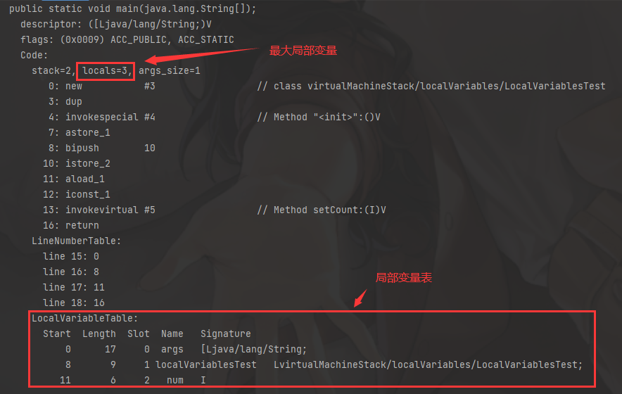

  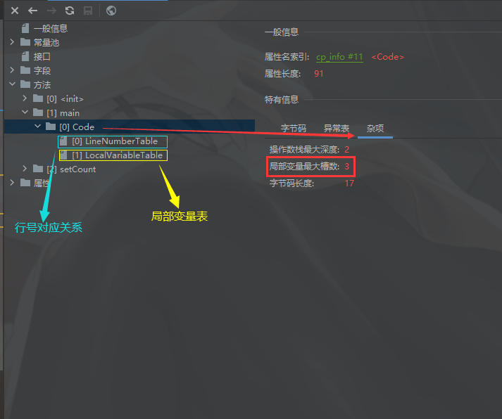

- **方法嵌套调用的次数由栈的大小决定，** 一般来说，**栈越大，方法嵌套调用次数越多。** 对一个函数而言，它的参数和局部变量越多，使得局部变量表膨胀，它的栈帧就越大，以满足方法调用所需传递的信息增大的需求。进而函数调用就会占用更多的栈空间，导致其嵌套调用次数就会减少

- **局部变量表的变量只在当前方法调用中有效。** 在方法执行时，虚拟机通过使用局部变量表完成参数值到参数变量列表的传递过程。**当方法调用结束后，随着方法栈帧的销毁，局部变量表也会随之销毁。**


**slot**

- 参数值的存放总是在局部数组的 index0 开始，到数组长度 -1 的索引结束

- 局部变量表，最基本的存储单元是Slot（变量槽）

- 局部变量表中存放编译期控制的个各种基本数据类型（8种），引用 类型（reference），returnAddress类型的变量。

- 在局部变量表里，**32位以内的类型只占用一个slot（包括 returnAddress 类型），64位的类型（long 和 double）占用两个slot**。

  - byte、short、char 在存储前被转换位 int，boolean 也被转换为 int，0 表示 false，非 0 表示 true
  - long 和 double 则占据两个 Slot

- JVM会为局部变量表中的每一个Slot都分配一个访问索引，通过这个索引即可成功访问到局部变量表中指定的局部变量值

- 当一个实例方法被调用的时候，它的方法参数和方法体内部定义的局部变量将会**按照顺序被复制**到局部变量表中的每一个slot上。

  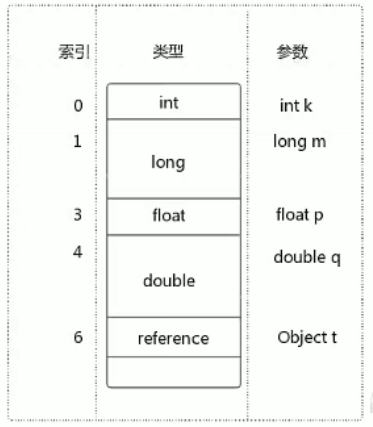

- **如果需要访问局部变量表中一个64bit的局部变量值时，只需要使用前一个索引即可。**（比如：访问long或double类型变量）

- 如果当前帧是由构造方法或者实例方法创建的，那么**该对象引用this将会存放在index为0的slot处**，其余的参数按照参数表顺序继续排列

- **栈帧中的局部变量表中的槽位是可以重用的**，如果一个局部变量过了其作用域，那么在其作用域之后申明的新的局部变量就很有可能会复用过期局部变量的槽位，**从而达到节省资源的目的**。

  举个例子：

  ```java
  public class SlotTest {
  
      public void test(){
          int a = 0;
          {
              int b = 0;
              b = a + 1;
          }
          // 变量c使用之前已经销毁的变量b占据slot的位置
          int c = a + 1;
      }
  }
  ```

  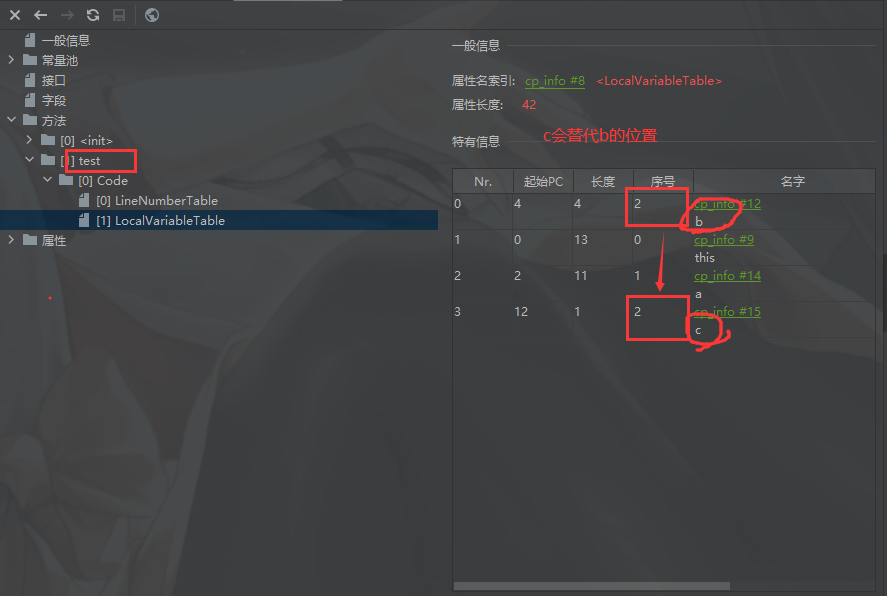

  

**静态变量与局部变量对比**

- 参数表分配完毕之后，再根据方法体内定义的变量的顺序和作用域分配。
- 我们知道类变量表有两次初始化机会，第一次是在 `准备阶段` ，执行系统初始化，对类变量设置零值，另一次则是在 `初始化` 阶段，赋予程序员在代码中定义的初始值。
- 和类变量初始化不同的是，局部变量表不存在系统初始化的过程，这意味着一旦定义了局部变量则必须人为初始化，否则无法使用。

```java
public void test(){
    int i; 
    System.out.println(i);
}
```

这样的代码是错误的，**没有复制不能够使用**。


**补充说明**

- 在栈帧中，与性能调优关系最为密切的部分就是前面提到的局部变量表。在方法执行时，虚拟机使用局部变量表完成方法的传递。
- 局部变量表的变量也是重要的垃圾回收根节点，只要被局部变量表中直接或间接引用 的对象都不会被回收。


#### **操作数栈**

（Operand Stack）（或表达式栈）

- 每一个独立的栈帧中除了包含局部变量表以外，还包含一个**后进先出**（Last-In-First-Out）的操作数栈，也可以称之为**表达式栈**（Expression Stack）
- 操作数栈，在方法执行过程中，根据字节码指令，往栈中写入数据或提取数据，即入栈（push）/出栈（pop）。
  - 某些字节码指令将值压入操作数栈，其余的字节码指令将操作数取出栈。使用它们后再把结果压入栈。
  - 比如：执行复制、交换、求和等操作
- 操作数栈，**主要用于保存计算过程的中间结果，同时作为计算过程中变量临时的存储空间**
- 操作数栈就是JVM执行引擎的一个工作区，当一个方法开始执行的时候，一个新的栈帧也会随之被创建出来，**这个方法的操纵数栈式空的**。
- 每一个操作数栈都会拥有一个明确的方法的栈深度用于存储数值，其所需的最大深度在编译期就定义好了，保存在方法的Code属性中，为max_stack的值。
- 栈中的任何一个元素都是可以任意的Java数据类型。
  - 32bit的类型占用一个栈单位深度
  - 64bit的类型占用两个栈单位深度
- 操作数栈**并非采用访问索引的方式来进行数据访问**的，而是只能通过标准的入栈（push）和出栈（pop）操作来完成一次数据访问。
- **如果被调用的方法有返回值的话，其返回值将会被压入当前栈帧的操作数栈中**，并更新PC寄存器中下一条需要执行的字节码指令。
- 操作数栈中元素的数据类型必须与字节码指令的序列严格匹配，这由编译器在编译器期间进行验证，同时在类加载过程中的类检验阶段的数据流分析阶段要再次验证。
- Java虚拟机的**解释引擎式基于栈的执行引擎**，其中的栈指的就是操作数栈

#### **动态链接**

（Dynamic Linking）（或指向运行时常量池的方法引用）

- 每一个栈帧内部都包含一个指向 `运行时常量池` 中该栈帧所属方法的引用。包含这个引用的目的就是为了支持当前方法的代码能够实现**动态链接（Dynamic Linking）**。比如： invokedynmic 指令

- 在Java源文件被编译到字节码文件中那个时，所有的变量和方法引用都作为符号引用（Symbolic Reference）保存在class文件的常量池里。比如：描述一个方法调用了另外的其他方法时，就是通过常量池中指向方法的符号引用来表示的，那么**动态链接的作用就是为了将这些符号引用转换为调用方法的直接引用**。

  > 常量池的作用，就是为了提供一些符号和常量，便于指令的识别

#### **方法返回地址**

（Return Address）（或方法正常退出或者异常退出的定义）

- 存放调用该方法的pc寄存器的值。
- 无论通过哪种方式退出，在方法退出后都返回到该方法被调用的位置。方法正常退出时，**调用者的 pc 寄存器的值作为返回地址，即调用该方法的指令的下一条指令的地址。**而通过异常退出的，返回地址是要通过异常表来确定，栈帧中一般不会保存这部分信息。

一个方法的结束，有两种方式：

1. 执行引擎遇到任意一个方法返回的字节码指令（return），会有返回值传递给上层的方法调用者，简称 `正常完成出口`：

   - 一个方法在正常调用完成之后究竟需要使用哪一个返回指令还需要根据方法返回值的实际数据类型而定
   - 在字节码指令中，返回指令包含 ireturn （当返回值是 boolean、byte、char、short 和 int 类型时使用）、lreturn、 freturn、dretun 以及 areturn（引用类型），另外还有一个 return 指令供声明为 void 的方法、实例初始化方法、类和接口的初始化方法使用。

2. 在方法执行的过程中遇到了异常（Exception），并且这个异常没有在方法内进行处理，也就是只要在本方法的异常表中没有搜索到匹配的异常处理器，就会导致方法退出。简称 `异常完成出口` 。

   ```java
   public class TryException {
   
       public void method1(){
           try {
               this.method2();
           }catch (Exception e){
   
           }
       }
   
       public void method2() throws Exception{
           throw new Exception();
       }
   }
   ```

   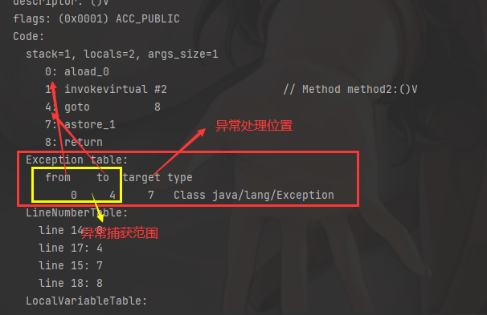


- 本质上，方法的退出就是当前栈帧出栈的过程。此时，需要恢复上层方法的局部变量表、操作数栈、将返回值压入调用者栈帧的操作数栈、设置 PC 寄存器值等，让调用者方法继续执行下去。
- 正常完成出口和异常完成出口的区别在于：**通过异常完成出口退出的不会给他上层调用者产生任何返回值**。

#### **一些附加信息**           

栈帧还允许携带与Java虚拟机实现相关的一些附加信息。例如，对程序调试提供支持的信息                              

###  栈顶缓存技术

（Top-of-Stack Cashing）

​	基于栈式架构的虚拟机所使用的零地址指令更加紧凑，但完成一项操作的时候必然需要使用更多的入栈和出栈操作，这同时也就意味着需要更多的指令分派（instruction dispatch）次数和内存读/写次数。

​	由于操作数是存储在内存中的，因为频繁地执行内存读/写操作必然会影响执行速度。为了解决这个问题，HotSpot JVM 地设计者们提出了栈顶缓存（ToS， Top-of-Stack Cashing）技术，**将栈顶元素全部缓存在物理CPU的寄存器中，以此降低对内存的读/写次数，提升执行引擎的执行效率**。

#### 方法的调用

在JVM中，将符号引用转换为调用方法的直接引用与方法的绑定机制相关

- 静态链接

  当一个字节码文件被装载进JVM内部时，如果被调用的**目标方法在编译期可知**，且运行期保持不变时。这种情况下将调用方法的符号引用转换为直接引用的过程称之为静态链接。

- 动态链接

  如果**被调用的方法在编译期无法被确定下来**，也就是说，只能够在程序运行期将调用方法的符号引用转换为直接引用，由于这种引用转换过程具备动态性，因此也就被称之为动态链接。

对应的方法绑定机制为：早期绑定（Early Binding）和晚期绑定（Late Binding）。绑定是一个字段、方法或者类在符号引用被替换为直接引用的过程，这仅仅发生一次。

- 早期绑定

  早期绑定就是指被调用的**目标方法如果在编译期可知，且运行期间保持不变**时，即可将这个方法与所属的类型进行绑定，这样依赖，由于明确了被调用的目标方法究竟是哪一个，因此也就可以使用静态链接的方式将符号引用转换为直接引用。

- 晚期绑定

  如果**被调用的方法在编译器无法被确定下来，只能够在程序运行期根据实际的类型绑定相关的方法**，这种绑定方式也就称之为晚期绑定

​	随着高级语言的横空出世，类似于Java一样的基于面向对象的编程语言如今越来越多，尽管这类编程语言在语法风格上存在一定的差别，但是他们彼此之间始终保持着一个共性，那就是都支持封装、继承和多态等面向对象特性，既然**这一类编程语言具备多态特性，那么自然也就具备早期绑定和晚期绑定两种绑定方式**。

​	Java中任何一个普通的方法其实都具备虚函数的特征，他们相当于C++语言中的虚函数（C++中则需要使用关键字virtual来显式定义）。如果在Java程序中不希望某个方法拥有虚函数的特征时，则可以使用关键字final来标记这个方法。


#### 虚方法和非虚方法

**非虚方法**

- 如果方法在编译器就确定了具体的调用版本，这个版本在运行时是不可变的。这样的方法称为 `非虚方法`。
- 静态方法、私有方法、final方法、实例构造器、父类方法都是非虚方法。
- 其他方法称为虚方法。

虚拟机中提供了以下几条方法调用指令：

- 普通调用指令：
  1. `invokestatic`：**调用静态方法，解析阶段确定唯一方法版本**
  2. `invokespecial`： **调用`<init>`方法、私有及父类方法，解析阶段确定唯一方法版本**
  3. `invokevirtual`：调用所有虚方法
  4. `invokeinterface`：调用接口方法
- 动态调用指令
  1. `invokedynamic`：动态解析处需要调用的方法，然后执行

​	前四条指令固化在虚拟机内部，方法的调用执行不可人为干预，而invokedynmic指令则支持由用户确定方法版本。其中**invokestatic指令和invokespecial指令第哦啊用的方法陈伟非虚方法，其余的（final修饰的除外）称为虚方法**。


**关于 invokedynamic 指令**

- JVM 字节码指令集一直比较稳定，直到 Java7 中才增加了一个 invokedynmic 指令，这是**Java 为了实现【动态类型语言】支持而做的一种改进** 
- 但是在 Java7 中并没有提供直接生成 invokedynamic指令的方法，需要借助 ASM 这种底层字节码工具来产生 invokedynamic 指令。**直到Java8的Lambda表达式的出现， invokedynamic指令的生成，在Java中才有了直接的生成方式。**
- Java7 中增加的动态语言类型支持的本质是对 Java 虚拟机规范的修改，而不是对Java语言规则的修改，这一块相对来讲比较复杂，增加了虚拟机中的方法调用，最直接的受益者就是运行在Java平台的动态语言的编译器。

#### 方法重写的本质

1. 找到操作数栈顶的第一个元素所执行的对象的实际类型，记作 `c`。
2. 如果在类型 `c` 中找到与常量中的描述符合简单名称都相符的方法，则进行访问授权校验，如果通过则返回这个方法的直接引用，查找过程结束；如果不通过，则返回 `java.lang.IllegalAccessError` 异常。
3. 否则，按照继承关系从下往上依次对 c 的各个父类进行第 2 步的搜索和验证过程。
4. 如果始终没有找到合适的方法，则抛出 `java.lang.AbstractMethodError` 异常。


**IllegalAccessError介绍：**

程序试图访问或修改一个属性或调用一个方法，这个属性或方法，你没有权限访问。一般的，这个会引起编译器异常。这个错误如果发生在运行时，就说明一个类发生了不兼容的改变。


#### 虚方法表

- 在面向对象的编程中，会很频繁的使用到动态分派，如果在每次动态分派的过程中都要重新在类得方法元数据中搜索合适的目标的话就可能影响到执行效率。因此，为了提高性能，JVM采用在类的方法区建立一个虚方法表（virtual method table）**（非虚方法不会出现在表中）来实现。使用索引表来代替查找。**

- 每个类中都有一个虚方法表，表中存放着各个方法的实际入口

- 虚方法表什么时候被创建？

  ​	虚方法表会在类加载的链接阶段被创建并开始初始化，类的变量初始值准备完成之后，JVM会把该类的方法表也初始化完毕。


### 🚀面试题

方法中定义的局部变量是否线程安全？ 具体问题具体分析

> **何为线程安全？**
>
> 如果只有一个线程才可以操作此数据，那么是线程安全的。
>
> 如果有多个 线程操作此数据，则此数据是共享数据。如果不考虑同步机制的话，会存在线程安全问题。

```java
public class StringBuilderTest {

    // s1的声明方式是线程安全的
    public static void method1(){

        StringBuilder s1 = new StringBuilder();
        s1.append("a");
        s1.append("b");
    }

    // stringBuilder的操作过程是线程不安全的
    public static void method2(StringBuilder stringBuilder){
        stringBuilder.append("a");
        stringBuilder.append("b");
    }


    // stringBuilder的操作是线程不安全的 注：定义上对象逃逸会引发线程不安全
    public static StringBuilder method3(){
        StringBuilder stringBuilder = new StringBuilder();
        stringBuilder.append("a");
        return stringBuilder;
    }

    // 线程安全 返回的是一个线程安全的对象
    public static String method4(){
        StringBuilder stringBuilder = new StringBuilder();
        stringBuilder.append("a");
        return stringBuilder.toString();
    }
}

```

> 补充一下关于发布与逃逸（后文也会详细讲）
>
> `发布`：简单来说就是提供一个对象的引用给作用域之外的代码。比如return一个对象，或者作为参数传递到其他类的方法中。
>
> `逃逸`：如果一个类还没有构造结束就已经提供给了外部代码一个对象引用即发布了该对象，此时叫做对象逸出，对象的逸出会破坏线程的安全性。


## 本地方法

### 本地方法接口

​	简单来说，一个 Native Method 就是一个 Java 调用非 Java 代码的接口。一个 Native Method 是这样一个 Java 方法：该方法的实现由非 Java 语言实现，比如 c。 这个特征并非 Java 所持有，很多其他的编程语言都有这一机制， 比如在 C++ 中，你可以用 extern "C" 告知 C++ 编译器去调用一个 C 的函数。

> "A native method is a Java method whose implementation is provided by non-java code."

在定义一个 native method 时，并不提供实现体（有些像定义一个 Java interface），因为其实现体是由非 Java 语言在外面实现的。

本地接口的作用时融合不同的编程语言为 Java 所用，它的初衷是融合 C/C++程序。

> 标识符 native 可以与所有其它的 java 标识符连用， 但是 abstract 除外

**为什么使用Native Method？**

- 与 Java 环境外交互

  **有时 Java 应用需要与 Java 外面的环境交互，这是本地方法存在的主要原因。**考虑Java需要与一些底层系统，如操作系统或者某些硬件交换信息时的情况。本地方法正是这样一种交流机制：他为我们提供了一个非常简洁的接口，而且我们无需去了解 Java 应用之外的繁琐细节。

- 与操纵系统交互

  JVM 支持着 Java 语言本身和运行的库，它是 Java 程序赖以生存的平台，它由一个解释器（解释字节码）和一些连接到本地代码的库组成。然而不管怎样，它毕竟不是一个完整的系统，他经常依赖于一些底层系统的支持。这些底层系统常常是强大的操作系统。**通过使用本地方法，我们得以用 Java 实现了 jre 的与底层系统的交互，甚至 JVM 的一些部分就是用法 C 写的。**还有，如果我们要使用一些 Java 语言本身没有提供封装的操作系统的特性时，我们也需要使用本地方法。

- Sun's Java

  **Sun的解释器是用C实现的，这使得它能像一些普通的C一样与外部交互。** jre大部分是用 Java 实现的，他也通过一些本地方法与外界交互。了例如：类 java.lang.thread 的 setPriority() 方法使用 Java 实现的，但是它实现调用的是该类里的本地方法 setPriority0（）。这个本地方法是用C实现的，并被植入JVM内部，在Windows 95 的平台上，这个本地方法最终将调用 Win32 SetPriority() API。这是一个本地方法的具体实现由 JVM 直接提供，更多的情况是本地方法由外部的动态链接库 `external dynamic link library` 提供，然后被 JVM 调用。


### 本地方法栈

**Native Method Stack**

- **Java 虚拟机栈用于管理 Java 方法的调用，而本地方法栈用于管理本地方法的调用。**
- 本地方法栈，也是线程私有的。
- 允许被实现成固定或者是可动态扩展的内存大小。（在内存溢出方面是相同的）
  - 如果线程请求分配的栈容量超过本地方法栈允许的最大容量，Java 虚拟机将会抛出一个 stackoverflowError 异常。
  - 如果本地方法栈可以动态扩展，并且在尝试扩展时无法申请到足够的内存，或者在创建新的线程时没有足够的内存区创建对应的本地方法栈，那么 Java 虚拟机将会抛出一个 OutOfMemoryError 异常
- 本地方法是使用 C 语言实现的
- 他的具体做法是 Native Method Stack 中登记 native 方法，在 Execution Engine 执行时加载本地方法库。

- **当某个线程调用一个本地方法时，他就进入了一个全新的并且不再受虚拟机限制的世界。他和虚拟机拥有同样的权限。**
  - 本地方法可以通过本地方法接口来**访问虚拟机内部的运行时数据区。**
  - 它甚至可以直接使用本地处理器中的寄存器
  - 直接从本地内存的堆中分配任意数量的内存。
- **并不是所有的 JVM 都支持本地方法，因为 Java 虚拟机规范并没有明确要求本地方法栈的使用语言、具体实现方式、数据结构等。**如果 JVM 产品不打算支持 native 方法，也可以无需实现本地方法栈。
- 在 Hotspot JVM 中，直接将本地方法栈和虚拟机栈合二为一。


## 堆

### 堆的核心概述

- 一个 JVM 实例只存在一个堆内存，堆也是 Java 内存管理的核心区域。

- Java 堆区在 JVM 启动的时候创建，其空间大小也就确定了。是 JVM 管理的最大一块内存空间。

  - 堆内存的大小是可以调节的。

- 《Java虚拟机规范》 规定，堆可以处于物理上不连续的内存空间中，但在逻辑上它应该被视为连续的。

- 所有的线程共享 Java 堆，在这里还可以划分线程私有的缓冲区（Thread Local Allocation Buffer，TLAB）。

- 《Java 虚拟机规范》中对 Java 堆的描述是：所有的对象实例以及数组都应当分配在堆上。

  > The heap is the run-time data area from which memory for all class instances and arrays is allocated

  从实际使用角度看 --  `几乎` 所有的对象实例都在这里分配内存

- 数组和对象可能永远不会存储在栈上，因为栈帧中保存引用，这个引用指向对象或者数组在堆中的位置

- 在方法结束后，队中的对象不会被马上移除，仅仅在垃圾收集的时候才会被移除。

- 堆，是 GC（Garbage Collection，垃圾收集器）执行垃圾回收的重点区域。

#### 内存细分

现代垃圾收集器大部分都基于分代收集理论设计，对空间细分为：

- Java 7 及之前堆内存 `逻辑上` 分为三部分：**新生区 + 养老区 + 永久区**
  - Young Generation Space 新生区 Young / New
    - 又被划分为 Eden 区和 Survivor 区
  - Tenure Generation Space 养老区 Old / Tenure
  - Permanent Space 永久区 Perm
- Java 8 及之后堆内存 `逻辑上` 分为三部分： **新生去 + 养老区 + 元空间**
  - Young Generation Space 新生区 Young / New
  - Tenure Generation Space 养老区 Old / Tenure
  - Meta Space 元空间 Meta 

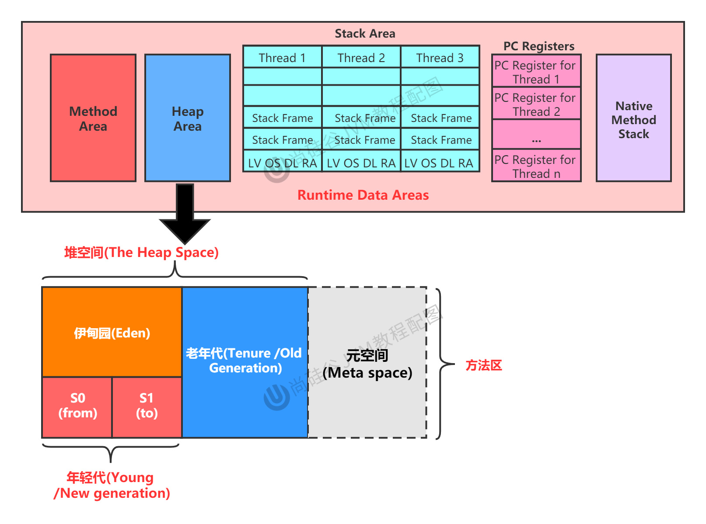

### 堆空间大小的设置

- Java 堆区用于存储 Java 对象实例，堆的大小在 JVM 启动时就已经设定好了，可以通过参数 `-Xmx`  和 `-Xms` 来进行设置。
  - `-Xms` 用于表示堆区的初始内存，等价于 `-XX:InitaialHeapSize`
    - -X 是 jvm 的运行参数
    - ms 是 memory start
  - `-Xmx` 则用于表示堆区的最大内存，等价于 `-XX:MaxHeapSize`
- 一旦堆区中的内存大小超过 `-Xmx` 所指定的最大内存时，将会抛出 `OutOfMemoryError` 异常。
- 通常会将 `-Xms` 和 `-Xmx` 两个参数配置相同的值，其目的是为了能够在 java 垃圾回收机制清理完堆区后不需要重新分割计算堆区的大小，从而提高性能。
- 默认情况下，
  - 初始内存大小：物理电脑内存大小 / 64
  - 最大内存大小：物理电脑内存大小 / 4
- 开发中建议将初始堆内存和最大的堆内存设置成相同的值

```java
public class HeapSpaceInitial {
    public static void main(String[] args) {

        // 返回 Java 虚拟机中的堆内存总量
        long initialMemory = Runtime.getRuntime().totalMemory() / 1024 / 1024;
        // 返回 Java虚拟机试图使用的最大堆内存量
        long maxMemory = Runtime.getRuntime().maxMemory() / 1024 / 1024;

        System.out.println("-Xms" + initialMemory + "M");
        System.out.println("-Xmx" + maxMemory + "M");

    }
}
// 结果
//-Xms489M
//-Xmx7246M

```


#### 相关参数

在以上代码中加入：

```java
		try {
            Thread.sleep(1000000);
        } catch (InterruptedException e) {
            throw new RuntimeException(e);
        }
```

> 配置 Vm options：
>
> -Xms500m -Xmx500m

程序运行结果：

```java
//-Xms479M
//-Xmx479M
```


`jps`  用于查看 java 中正在运行的进程

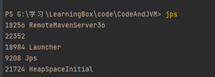

`jstat -gc ${进程代号}` 用于查看进程的内存使用情况

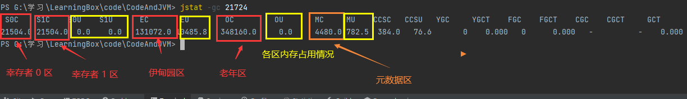

> **思考：**
>
> 幸存者 0 区 + 幸存者 1 区 + 伊甸园区 + 老年区 = 500M，然后程序得到的结果确实479M，为什么？
>
> 在新生代中，由于其算法，幸存者 0 区和 1 区 在使用时永远只会用到其中一个，故在计算实际内存时，只算其一内存

另：

> 配置 Vm options：
>
> -Xms500m -Xmx500m -XX:+PrintGCDetails

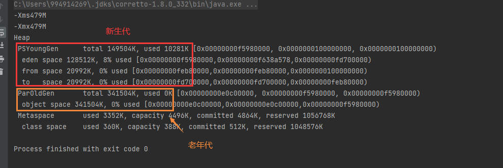


### 年轻代与老年代

- 存储在 JVM 中的 Java 对象可以划分为两类：
  - 一类是生命周期较短的瞬时对象，这类对象的创建和消亡都非常迅速。
  - 另外一类对象的生命周期却非常长，在某些极端的情况下还能够与 JVM 的生命周期保持一致。

- Java 堆区进一步细分的话，可以划分为年轻代 （YoungGen） 和老年代（OldGen）
- 其中年轻代又可以划分为Eden空间、Survivor0空间和Survivor1空间（有时也叫做 from 区，to 区）

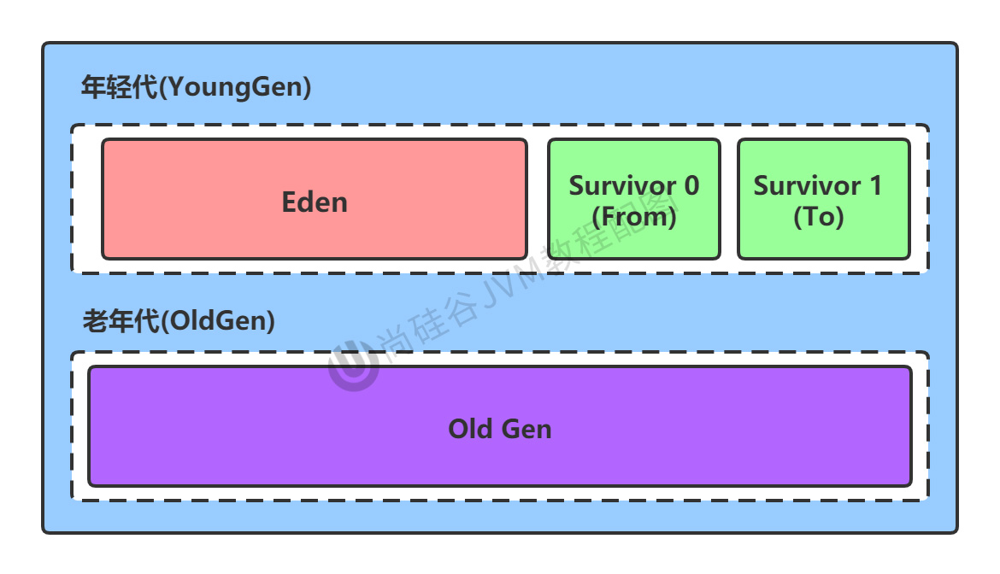

- 配置新生代与老年代在堆结构的占比

  - **默认** -XX:NewRatio=2, 表示新生代占1，老年代占2，新生代占整个堆的 1/3
  - => -XX:NewRatio=4，表示新生代占1，老年代占4， 新生代占整个堆的 1/5

  > 一般在开发中不配置此参数

- 在 HotSpot 中，Eden 空间和另外两个Survivor 空间缺省所占的比例是 8:1:1

  > 可以通过选项 `-XX:SurvivorRatio` 来调整这个空间比例
  >
  > 一般情况下，JVM有个自适应机制，导致可能实际比例不是 8:1:1
  >
  > 此时只有显示的调用`-XX:SurvivorRatio` 才可指定为该比例

- **几乎所有**的 Java 对象都是在 Eden 区被 new 出来了

  > 如果对象过大，就会直接放在老年区

- 绝大部分的 Java 对象的销毁都在新生代进行了。

  - IBM 公司的专门研究表明，新生代中 80% 的对象都是“朝生夕死”的/

- 可以使用选项  `-Xmn` 设置新生代最大内存大小

  - 这个参数一般使用默认值就可以了。

### 对象分配过程

​	为新对象分配内存时一件非常严谨和复杂的任务，JVM 的设计者们不仅需要考虑内存如何分配、在哪里分配等问题，并且由于内存分配算法与内存回收算法密切相关，所以还需要考虑 GC 执行完内存回收后是否会在内存空间中产生内存碎片。

1. new 的对象先放到 伊甸园区。此区有大小限制。

2. 当 伊甸园区 的空间填满时，程序又需要创建对象，JVM 的垃圾回收器将堆 伊甸园区 进行垃圾回收  `Minor GC`，将 伊甸园区 中的不再被其他对象所引用的对象进行销毁。再加载新的对象放到 伊甸园区。

3. 然后将 伊甸园区 中的剩余对象移动到幸存者 0 区。

4. 如果再次触发垃圾回收，此时上次幸存下来的凡是幸存者 0 区的，如果没有回收，就会放到幸存者 1 区。

5. 如果再此经历垃圾回收，此时会重新放回幸存者 0 区，接着再去幸存者 1 区。

6. 默认15次后进入养老区。

   > 可以设置参数 `-XX:MaxTenuringThreshold=<N>` 来配置什么时候进入养老区

7. 在养老区，相对悠闲。当养老区内存不足时，再此触发GC：`Major GC`，进行养老区的内存清理。

8. 若养老区执行了 `Major GC` 之后发现依然无法进行对象的保存，就会产生 OOM 异常


**总结**

- 针对幸存者s0，s1区的总结：复制之后有交换，谁空谁是to。
- 关于垃圾回收：频繁在新生区收集，很少在养老区收集，几乎不再永久区/元空间收集。

**对象分配的特殊情况**


**举个例子**

```java
package heapSpace;

import java.util.ArrayList;
import java.util.Random;

/**
 * @author sayCode
 * @date 2023/7/31 14:34
 * @project CodeAndJVM
 * @Title HeapInstanceTest
 * @description
 * VM options -Xms600m -Xmx600m
 */
public class HeapInstanceTest {

    byte[] buffer = new byte[new Random().nextInt(1024 * 200)];

    public static void main(String[] args) {
        ArrayList<HeapInstanceTest> list = new ArrayList<>();
        while (true){
            list.add(new HeapInstanceTest());

            try {
                Thread.sleep(10);
            } catch (InterruptedException e) {
                throw new RuntimeException(e);
            }
        }
    }

}

```

针对以上代码，查看具体GC情况：

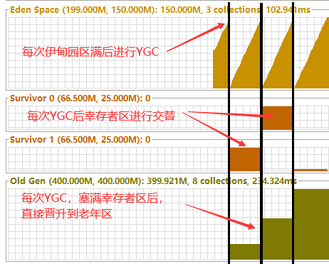


### 简析 Minor GC&Major GC&Full GC

​	JVM 在进行 GC 时，并非每次都对上面三个内存区域一起回收的，大部分时候回收的都是指新生代。

​	针对 HotSpot VM 的实现，它里面的 GC 按照回收区域又分为两大种类型，一种时部分收集（Partial GC），一种时整堆收集（Full GC）

- `部分收集`：不是完整收集整个 Java 堆的垃圾收集。其中又分为：
  - 新生代收集（Minor GC / Young GC）：只是新生代的垃圾收集。
  - 老年代收集（Major GC / Old GC）：只是老年代的垃圾收集。
    - 目前，只有 CMS GC 会有单独收集老年代的行为。
    - 注意，很多时候 Major GC 会和 Full GC 混淆使用，需要具体分辨是老年代回收还是整堆回收。
  - 混合收集（Mixed GC）：收集整个新生代以及部分老年代的垃圾收集。
    - 目前，只有 G1 GC 会有这种行为。
- `整堆收集`（Full GC）：收集整个 java 堆和方法区的垃圾收集。


**年轻代GC （Minor GC） 触发机制**

- 当年轻代空间不足时，就会触发 Minor GC，这里的年轻代满指的是 `Eden Space` 满，`Survivor Space` 满不会引发 GC。（每次 Minor GC 会清理年轻代的内存
- 因为 Java 对象**大多具备朝生夕灭**的特性，所以 Minor GC 非常频繁，印版回收速度也比较快。这一定义既清晰又易于理解。
- Minor GC 会引发 `STW`（stop the wrold），暂停其他用户线程，等垃圾回收结束，用户线程才恢复运行。


**老年代GC（Major GC / Full GC）触发机制**

- 指发生在老年代的GC，对象从老年代消失时，GC发生了。
- 出现了 Major GC，经常会伴随至少一次的 Minor GC（但不是绝对的，在Patallel Scavenge 收集器的收集策略里就有直接进行 Major GC 的策略选择过程）。
  - 在老年代空间不足时，会先尝试触发 Minor GC。如果之后空年间还不足，则会触发 Major GC。
- Major GC 的速度一般会比 Minor GC 慢 10 倍以上，STW 的时间更长。
- 如果 Major GC 后，内存还不足，就报 OOM 了。
- Major GC 的速度一般会比 Minor GC 慢 10 倍以上。

**Full GC 触发机制**（简析）

触发 Full GC 执行的情况又如下5种：

1. 调用 System.gc()时，系统建议执行 Full GC，但是不必然执行
2. 老年代空间不足
3. 方法区空间不足
4. 通过 Minor GC 后进入老年代的平均大小大于老年代的可用内存
5. 由 Eden Space、From Space 向 To Space 复制时，对象大小大于 To Space 可用内存，则把该对象转存到老年代，且老年代的可用内存小于该对象大小

> Full GC 是开发和调优种尽量要避免的，这样暂停时间会短一些


**GC 举例**

```java
package heapSpace;

import java.util.ArrayList;
import java.util.List;

/**
 * @author sayCode
 * @date 2023/7/31 16:25
 * @project CodeAndJVM
 * @Title GCTest
 * @description
 * VM options: -Xms9m -Xmx9m -XX:+PrintGCDetails
 */
public class GCTest {
    public static void main(String[] args) {
        int i = 0;
        try {
            List<String> list = new ArrayList<>();
            String a = "saycode.top";
            while (true){
                list.add(a);
                a = a + a;
                i ++;
            }
        } catch (Throwable t){
            t.printStackTrace();
            System.out.println("遍历次数为：" + i);
        }
    }
}
```

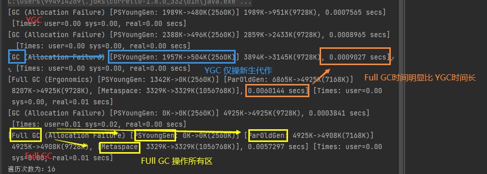

### 内存分配策略

又指 对象提升（Promotion）规则

针对不同年龄段的对象分配原则如下所示：

- 优先分配到 Eden
- 大对象直接分配到老年代
  - 尽量避免程序中出现过多的大对象
  - 更要避免存活时间短的大对象
- 长期存活的对象分配到老年代
- 动态对象年龄判断
  - **如果 Survivor 区中相同年龄的所有对象大小的总和大于 Survivor 空间的一半，年龄大于或等于该年龄的对象可以直接进入老年代**，无须等到 MaxTenuringThreshold 中要求的年龄。
- 空间分配担保
  - TODO
  - -XX:handlePromotionFailure

### TLAB

**为什么有TLAB（Thread Local Allocation Buffer）**

- 堆区是线程共享区域，任何线程都可以访问到堆区中的共享数据
- 由于对象实例的创建在 JVM 中非常频繁，因此在并发环境下从堆区换份内存空间是线程不安全的。
- 为避免多个线程操作同一地址，需要使用加锁机制，进而影响分配速度

**什么是TLAB**

- 从内存模型而不是垃圾收集的角度，对Eden区域继续进行划分，JVM 为**每个线程分配了一个私有缓存区域**，它包含在Eden Space内。

- 多线程同时分配内存时，使用 TLAB 可以避免一些列的非线程安全问题，同时还能够提升内存分配的吞吐量，因此我们可以将这种内存分配方式称之为 `快速分配策略`。
- 目前所有 OpenJDK 衍生出来的 JVM 都提供了 TLAB 的设计。

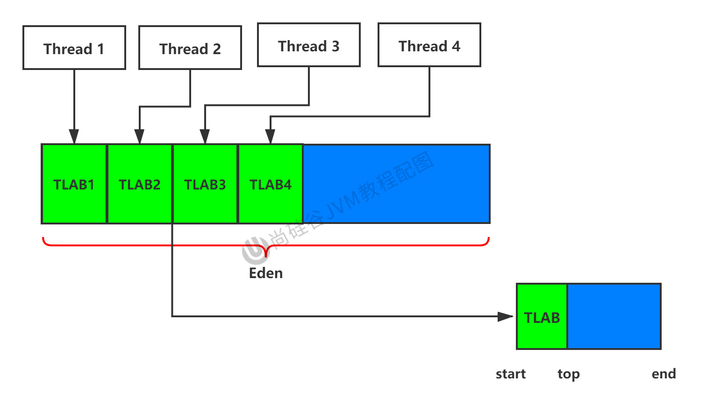

- 尽管不是所有的对象实例都能在 TLAB 中成功分配内存，但 JVM 确实是将 TLAB 作为存分配的首选
- 在程序中，开发人员可以通过选项 `-XX:UseTLAB` 设置是否开启 TLAB 空间
- 默认情况下，TLAB 空间的内存非常小，仅占有整个 Eden Space 空间的1%，当然我们可以通过选项 `-XX:TLABWasteTargetPercent` 设置 TLAB 空间所占用 Eden Space 的百分比大小
- 一旦对象在 TLAB 空间分配内存失败时，JVM 就会尝试着通过使用加锁机制确保数据操作的原子性，从而直接在 Edne Space 中分配内存。

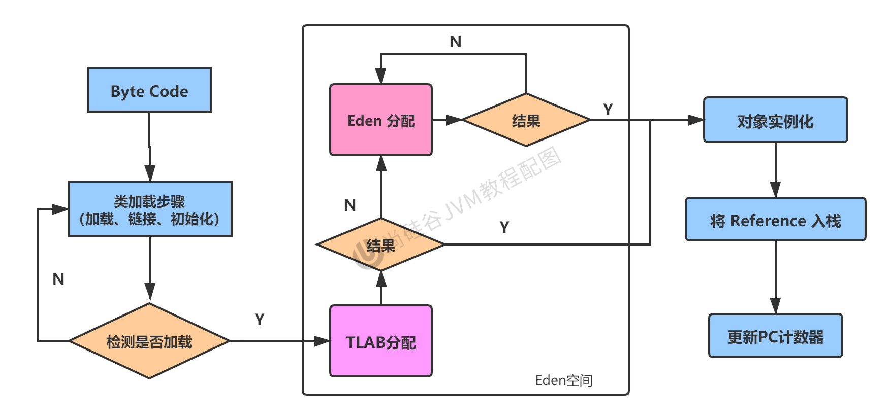

**详细分析 TLAB**

> 由于相关视频和数据没有更详细的 TLAB 资料，故从网上找到一些内容进行一些补充

- **TLAB 的线程独享是针对于分配动作的**，至于读取、垃圾回收等工作是线程独享的，在使用上也不会有区别

  即：

  - 虽然每个线程在初始化时都会去堆内存中申请一块 TLAB，并不是说这个 TLAB 区域的内存其他线程就完全无法访问了，其他线程的读取还是可以的，只不过无法在这个区域中分配内存而已。
  - 在 TLAB 分配之后，并不影响对象的移动和回收，也就是说，虽然对象刚开始可能通过 TLAB 分配内存，存放在 Eden 区，但是还是会被垃圾回收或者被移到 S 区和老年代等。

- **TLAB 带来的问题**

  - 主要问题就是因为 TLAB 空间太小导致的。

    比如一个线程的 TLAB 空间有 100KB，其中已经使用了 80KB，当需要再分配一个 30KB 的对象时，就无法直接在 TLAB 中分配，遇到这种情况时有两种处理方案：

    - 直接在堆内存中对该对象进行内存分配。
    - 废弃当前的 TLAB，重新申请 TLAB 空间再次进行内存分配。

    方案 1 的话，如果 TLAB 只剩下 1KB 的空间了，那么后续的大多数对象都需要在堆内存中分配，方案 2 的话，有可能会有频繁的废弃 TLAB 申请 TLAB 的情况。TLAB 内存自己从堆中进行分配时也是需要并发控制的，而频繁的分配 TLAB 就失去了 TLAB 的意义了。

    

    为了解决这个问题，虚拟机定义了一个 refill_waste 的值，这个值可以翻译为”最大浪费空间“。

     

    当 TLAB 剩余空间不足时，

    1. 若请求分配的内存大于 refill_waste，会选择在堆内存中分配。
    2. 若请求分配的内存小于 refill_waste，会选择废弃当前的 TLAB，重新创建 TLAB 进行对象内存分配。

    前面的例子中，TLAB总空间100KB，使用了80KB，剩余20KB，如果设置的refill_waste的值为25KB，那么如果新对象的内存大于25KB，则直接堆内存分配，如果小于25KB，则会废弃掉之前的那个TLAB，重新分配一个TLAB空间，给新对象分配内存。

  - 上面的问题解决又引发了以下两个问题

    - Eden空间够的时候，你再次申请TLAB没问题，我不够了，Heap的Eden区要开始GC。
    - TLAB允许浪费空间，导致Eden区空间不连续，积少成多。以后还要人帮忙打理。

    这些都是 TLAB 的缺点

### 堆空间的参数设置

[官方参数文档](https://docs.oracle.com/javase/8/docs/technotes/tools/unix/java.html#BGBCIEFC)

- `-XX:+PrintFlagsInitial` : 查看所有参数的默认初始值

- `-XX:+PrintFlagsFinal` : 查看所有的参数的最终值（可能会存在修改，不再是初始值）

  

- `-Xms` : 初始堆内存空间（默认为物理内存的 1 / 64）

- `-Xmx` : 最大堆内存空间（默认为物理内存的 1 / 4）

- `-Xmn` : 设置新生代的大小 （初始值及最大值）

- `-XX:NewRatio` : 配置新生代与老年代在堆结构的占比

- `-XX:SurvivorRatio` : 设置新生代中 Eden Space 和 s0 / s1 Space 空间的比例

- `-XX:MaxTenuringThreshold` : 设置新生代垃圾的最大年龄

- `-XX:+PrintGCDetails` : 输出详细的 GC 处理日志

- 打印 GC 简要信息 

  - `-XX:+PrintGC`
  - `-verbose:gc`

- `-XX:HandlePromotionFailure`: 是否设置空间分配担保

**相关java指令**

- `jps`：查看当前运行中的进程
- `jinfo -flag SurvivorRatio ${进程Id}` 

**关于空间分配担保**

​	在发生 Minor GC 之前，虚拟机会 **检查老年代最大可用的连续空间是否大于新生代所有对象的总空间**

- 如果大于，则此次 Minor GC 是安全的。
- 如果小于，则虚拟机会查看 `-XX:HandlePromotionFailure` 设置值是否允许担保失败。
  - 如果 `HandlePromotionFailure=true`，那么会继续 **检查老年代最大可用连续空间是否大于历次晋升到老年代的对象的平均大小**。
    - 如果大于，则尝试进行一次 Minor GC，但这次 Minor GC 依然是有风险的。
    - 如果小于，则改为进行一次 Full GC。
  - 如果 `HandlePromotionFailure=false` 则改为进行一次 Full GC。

​	在 JDK6 Update24 之后， `HandlePromotionFailure` 参数不会再影响到虚拟机的空间分配担保策略，观察 OpenJDK 中的源码变化，虽然源码中还定义了 HandlePromotionFailure 参数，但是在代码中已经不会再使用它。JDK6 Update24 之后的规则变为 **只要老年代的连续空间大于新生代对象总大小** 或者 **历次晋升的平均大小就会进行 Minor GC**，否则将进行Full GC

### 逃逸分析 -- 堆（白学警告）

**堆是分配对象存储的唯一选择嘛？**

​	在《深入理解Java虚拟机》中关于 Java 堆内存有这样一段描述：随着 JIT 编译器的发展与 **逃逸分析技术** 的逐渐成熟，`栈上分配`、`标量替换优化技术` 将会导致一些微妙的变化，所有的对象都分配到堆上也渐渐变得不那么“绝对”了。

​	在 Java 虚拟机中，对象是在 Java 堆中分配内存的，这是一个普遍的常识。但是，有一种特殊情况，那就是 **如果进行逃逸分析（Escape Analyisis）后发现，一个对象并没有逃逸出方法的话，那么就可能被优化成栈上分配。**这样就无需在堆上分配内存，也无需进行垃圾回收了。这也是最常见的堆外存储技术。

​	此外，基于 OpenJDK 深度定制的 TaoBaoVM，其中创新的 GCIH（GC invisible heap）技术实现 off-heap，将生命周期较长的 Java 对象从 heap 中移至 heap 外，并且 GC 不能管理 GCIG 内部的 Java 对象， 以此达到降低 GC 的回收频率和提升 GC 的回收效率的目的。


**逃逸分析**

- 如何将堆上的对象分配到栈，需要使用逃逸分析手段
- 这是一种可以有效减少 Java 程序中同步负载和内存堆分配压力的跨函数全局数据流分析算法
- 通过逃逸分析，Java Hotspot 编译器能够分析出一个新的对象的引用的使用范围从而决定是否要将这个对象分配到堆上。
- 逃逸分析的基本行为就是分析对象动态作用域：
  - 当一个对象在方法中被定义后，对象只在方法内部使用，则认为没有发生逃逸。
  - 当一个对象在方法中被定义后，它被外部方法所引用，则认为发生逃逸。例如作为调用参数传递到其他地方中。


**参数设置**

- 在 JDK 7时， HotSpot 中默认就已经开启了逃逸分析。
- 如果使用的是较早的版本，开发人员则可以通过：
  - `-XX:+DoEscapeAnalysis` 显示开启逃逸分析
  - `-XX:+PrintEscapeAnaysis` 查看逃逸分析的筛选结果


**结论**

开发中能使用局部变量的，就不要使用在方法外定义


### 逃逸分析 -- 代码优化

使用逃逸分析，编译器可以对代码做如下优化：

-  `栈上分配`：将堆分配转化为栈分配。如果一个对象在子程序中被分配，要使指向该对象的指针永远不会逃逸，对象可能是栈分配的候选，而不是堆分配
- `同步省略`： 如果一个对象被发现只能从一个线程被访问到，那么对于这个对象的操作可以不考虑同步。
- `分离对象或标量替换`：有的对象可能不需要作为一个连续的内存结构存在也可以被访问到，那么对象的部分（或全部）可以不存储在内存，而是存储在 CPU寄存器 中。

#### 栈上分配

- JIT 编译器在编译期间根据逃逸分析的结果，发i西安如果一个对象并没有套一处方法的话，就可能被优化成栈上分配。分配完成后，继续在调用栈内执行，最后线程结束，栈空间被回收，局部变量对象也被回收。这样就无需进行垃圾回收了。

#### 同步省略

- 线程同步的代价是相当高的，同步的后果是降低并发性和性能
- 在动态编译同步块的时候，JIT 编译器可以借助逃逸分析来**判断同步块所使用的锁是否只能够被一个线程访问而没有被发布到其他线程**。如果没有，那么 JIT 编译器在编译这个同步块的时候就会取消对这部分代码的同步。这样就能大大提高并发性和性能。这个取消同步的过程就叫同步省略，也叫锁消除

#### 标量替换

- 标量（Scalar）是指一个无法再分解成更小的数据的数据。Java 中的原始数据类型就是标量。
- 相对的，那些还可以分解的数据叫做聚合量（Aggregate），Java中的对象就是聚合量，因为他可以分解成其他聚合量和标量。
- 在 JIT 阶段，如果经过逃逸分析，发现一个对象不会被外界访问的话，那么经过 JIT 优化，就会把这个对象拆解成若干个其中包含的若干个成员变量来代替。这个过程就是标量替换
-  `-XX:+EliminateAllocations`:  开启标量替换（默认打开），允许将对象打散分配在栈上

**逃逸分析测试**


> vm options: -Xmx256m -Xms256m -XX:-DoEscapeAnalysis -XX:+PrintGCDetails

```java
package heapSpace;

/**
 * @author sayCode
 * @date 2023/8/1 13:50
 * @project CodeAndJVM
 * @Title StackAllocation
 * @description 线上分配测试
 * vm options: -Xmx256m -Xms256m -XX:-DoEscapeAnalysis -XX:+PrintGCDetails
 */
public class StackAllocation {

    public static void main(String[] args) {
        long start = System.currentTimeMillis();

        for (int i = 0; i < 10000000; i++){
            alloc();
        }
        long end = System.currentTimeMillis();
        System.out.println("花费时间："+(end - start)+"ms");
    }

    private static void alloc() {
        User user = new User();
    }

}

class User{

}
```

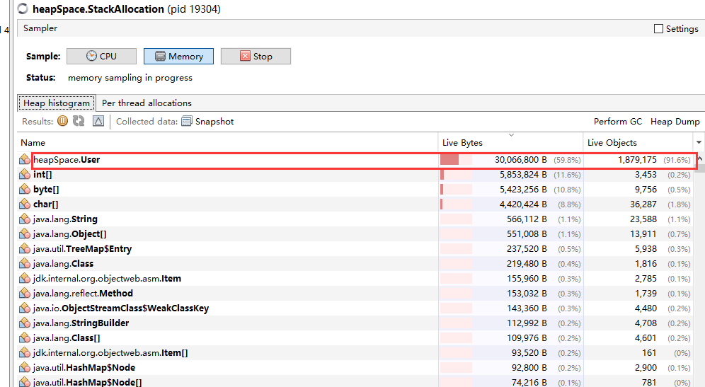

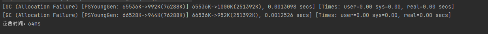

上方为不开启逃逸分析的情况，可见，User占用量较大，包含两次GC，花费时间较长

现在调整虚拟机参数，开启逃逸分析：

> vm options: -Xmx256m -Xms256m -XX:+DoEscapeAnalysis -XX:+PrintGCDetails

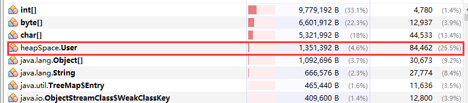

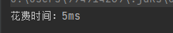

开启逃逸分析后，明显可以看出，User创建量大大减小，没有进行过GC，花费时间也减少

#### 小结（为什么白学）

- 关于逃逸分析的论文在1999年就已经发表了，但直到 JDK 1.6 才有实现，而且这项技术到如今也并不是十分成熟。
- 其根本原因就是**无法保证逃逸分析的性能消耗一定能高于他的消耗。虽然经过逃逸分析可以做标量替换、栈上分配、锁消除。但是逃逸分析自身也是需要进行一系列复杂的分析的，这其实也是一个相对耗时的功能。**
- 一个极端的例子，就是经过逃逸分析之后，发现没有一个对象时不逃逸的。那这个逃逸分析的过程就白白浪费掉了
- 虽然这项技术并不十分成熟，但是她**也是及时编译器优化技术中的一个十分重要的手段**。
- 注意到有一些观点，认为通过逃逸分析，JVM会在栈上分配那些不会逃逸的对象，这在理论上是可行的，但是取决于 JVM 设计者的选择。据宋红康所知， Oracle Hotspot JVM 中并未这么做，这一点在逃逸分析相关的文档里已经说明，所以可以明确所有的对象实例都是创建在栈上
- 目前很多书籍还是基于 JDK 7 以前的版本，JDK 已经是发生了很大改变，intern 字符串的缓存和静态变量曾经都被分配在永久代上，而永久代已经被元数据区取代。但是，intern 字符串缓存和静态变量并不是被转移到元数据区，而是直接在堆上分配，所以这一点同样符合前面一点的结论：**对象实例都是分配在堆上。**


### 堆小结

- 年轻代是对象的诞生、成长、消亡的区域，一个对象在这里产生、应用，最后被垃圾回收器收集、结束生命。
- 老年代放置长生命周期的对象，通常都是从Survivor区域筛选拷贝过来的Java对象。当然，也有特殊情况，我们直到普通的对象会被分配在 TLAB 上；如果对象较大，JVM会试图直接分配在 Eden 其他位置上；如果对象台打，完全无法在新生代找到足够长的连续空闲空间，JVM 就会直接分配到老年代。
- 当 GC 只发生在年轻代中，回收年轻代对象的行为被称为 MinorGC。当GC发生在老年代时则被称为 MajorGC 或者 FullGC。一般的，MinorGC 的发生频率要比 Major GC 高很多，即老年代中垃圾回收发生的频率将大大低于年轻代。

## 方法区（元空间）

《Java虚拟机规范》中明确说明：尽管所有的方法区在逻辑上是属于堆的一部分，但一些简单的实现可能不会选择去进行垃圾收集或者进行压缩。但对于 HotSpot JVM 而言，方法去还有一个别名交作 Non-Heap（非堆），目的就是要和堆分开。

所以，**方法区看作是一块独立于 Java 堆的内存空间**。

**栈、堆、方法区交互关系**

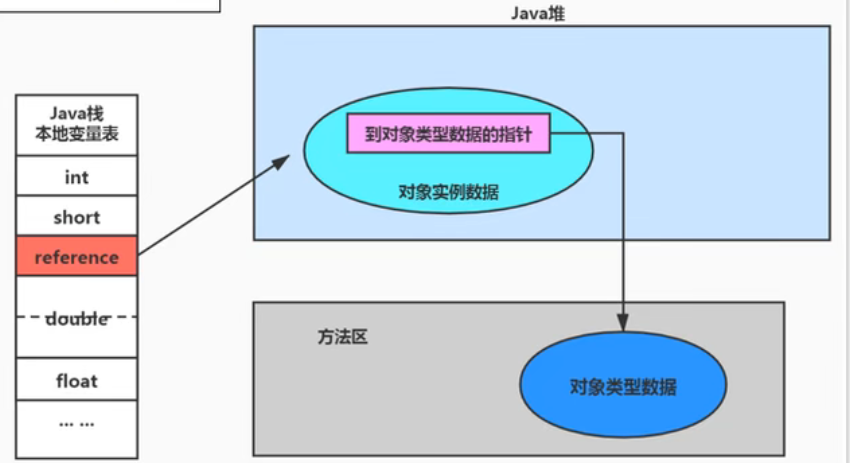

 

### 基本理解

- 方法区（Method Area）与 Java 堆一样，是各个线程共享的内存区域。
- 方法区在 JVM 启动的时候被创建，并且它的实际的物理内存空间中和 Java 堆区一样都是可以不连续的。
- 方法区的大小，跟堆空间一样，可以选择固定大小或者可扩展。
- 方法区的大小决定了系统可以保存多少个类，如果系统定义了太多的类，导致方法区溢出，虚拟机同样会抛出内存溢出错误：`java.lang.OutOfMemoryError`
- 关闭 JVM 就释放这个区域的内存


元空间不在虚拟机设置的内存中，而是使用本地内存

### 设置方法区内存大小

- 方法区的大小不必是固定的，jvm 可以根据应用的需要动态调整。

- jdk7 及以前：

  - 通过 `-XX:permSize` 来设置之永久代初始分配空间。默认值是 20.75M。
  - `-XX:MaxPermSize` 来设定永久代最大可分配空间。32为机器默认是 64M，64位机器默认是 82M
  - 当 JVM 加载的类信息超过了这个值，会报异常 OutOfMemoryError:PermGen space

- jdk 8 以后

  - 元数据区大小可以使用参数 `-XX:MetaspaceSize` 和 `-XX:MaxMetaspaceSize` 指定，替代上述原有的两个参数。
  - 默认值依赖于平台。 **Windows下， `-XX:MetaspaceSize` 是21M， `-XX:MaxMetaspaceSize` 的值是 -1， 即没有限制。**
  - 与永久代不同，如果不指定大小，默认情况下，虚拟机会耗尽所有的可用系统内存，如果元数据区发生溢出，虚拟机一样会抛出异常 `OutOfMemoryError:Metaspace`.
  - `-XX:MetaspaceSize`：设置初始的元空间大小。对于一个 64 位的服务器端 JVM 来说，其默认的初始值为 21MB。这就是初始的高水位线，一旦触及这个水位线，Full GC将会触发并卸载没用的类（即这些类对应的类加载器不再存活），然后这个高水位线将会重置。新的高水位线的值取决于 GC 后释放了多少元空间。如果释放的空间不足，那么在不超过 MaxMetaspaceSize的情况下，适当提高该值。如果释放空间过多，则时代那个降低该值。
  - 如果初始化的高水位线设置过低，上述高水位线调整情况会发生很多次。通过垃圾回收器的日志可以观察到 Full GC多次调用。为了避免频繁地GC，建议将 `-XX:MetaspaceSize` 设置为一个相对较高地值。


#### 如何解决 OOM 异常

1. 要解决 OOM 异常或 heap space 的异常，一般的手段是首先通过内存映像分析工具（如  Eclipse Momory Analyzer）对 dump 出来的堆转储快照进行分析，重点是确认内存中的对象是否是必要的，也就是要先分清楚到底时出现了 内存泄漏（Memory Leak）还是 内存溢出（Memory Overflow）。

2. 如果是内存泄漏，可进一步通过工具查看泄露对象到 GC Roots 的引用链。于是就能找到泄露对象是通过怎样的路径与 GC Roots 相关联并导致垃圾收集器无法自动回收他们的。掌握了泄露对象的类型信息，以及 GC Roots 引用链的信息，就可以比较准确的定位出泄露代码的位置
3. 如果不存在内存泄露，换句话说就是内存中的对象确实都还必须存活着，那就应当检查虚拟机的堆参数（-Xmx 与 -Xms），与机器物理内存对比看是否还可以调大，从代码上检查是否存在某些对象生命周期过长、持有状态时间过长的情况，尝试减少程序运行期间的内存消耗。

### 方法区内部结构

它用于存储已被虚拟机加载的**类型信息、常量、静态变量、即时编译器后的代码缓存等**。


#### 类型信息

对每个加载的类型（类class、接口interface、枚举enum、注解annotation），JVM 必须在这方法区中存储以下类型信息：

- 这个类型的完成有效名称（全名 = 报名.类名）
- 这个类型直接父类的完整有效名（对于 interface 或是 java.lang.Object, 都没有父类）
- 这个类型的修饰符（public，abstract，final的某个子集）
- 这个类型直接接口的一个有序列表

#### 域信息（Field）

即成员变量

- JVM 必须在方法区中保存类型的所有域的相关信息以及域的声明
- 域的相关信息包括：域名称、域类型、域修饰符（public，private，protected，static，final，volatile，transient的某个子集）


#### 方法信息（Method）

JVM 必须保存所有方法的以下信息，同域信息一样包括声明顺序

- 方法名称
- 方法的返回类型

- 方法参数的数量和类型（按顺序）
- 方法的修饰符
- 方法的字节码（bytecodes）、操作数栈、局部变量表及大小（abstract 和 native 方法除外）
- 异常表 （abstract 和 native方法除外）
  - 每个异常处理的开始位置、结束位置、代码处理在程序计数器中的偏移地址、被捕获的异常类的常量池索引


#### 全局常量

即被 static final 修饰的变量

被声明为final的类变量的处理方法则不同，每个全局常量在编译的时候就会被分配了

### 运行时常量池

#### 常量池

​		一个有效的字节码文件中除了包含类的版本信息、字段、方法以及接口等描述信息外，还包含一项信息那就是常量池表（Constant Pool Table），包含各种字面量和对类型、域和方法的符号引用。

**为什么需要常量池**

​	一个 java 源文件中的类、接口，编译后产生一个字节码文件。而 Java 中的字节码需要数据支持，通常这种数据会很大以至于不能直接存到字节码里，换一种方式，可以存到常量池，这个字节码包含了指向常量池的引用。在动态链接的时候会用到运行时常量池，之前有介绍。

#### 运行时常量池

- 运行时常量池（Runtime Constant Pool）是方法区的一部分。

- 常量池表（Constant Pool Table）是 Class 文件的一部分，**用于存放编译期生成的各种字面量与符号引用，这部分内容将在类加载后存放到方法区的运行时常量池。**
- JVM 为每个已加载的类型（类或接口）都维护一个常量池。池中的数据项像数组项一样，是通过索引访问的。
- 运行时常量池中包含那多种不同的常量，包含编译器就已经明确的数值字面量，也包括到运行期解析后才能够获得的方法或者字段引用。此时不再是常量池中的符号引用了，这里换为真实地址。
  - 运行时常量池，相对于Class文件常量池的另一个重要特征是：**具备动态性**
- 运行时常量池类似于传统编程语言中的符号表（symbol table），但是它所包含的数据却比符号表要更加丰富一些
- 当创建类或接口的运行时常量池时，如果构造运行时常量池所需的内存空间超过了方法区所能提供的最大值，则 JVM 会抛 `OutOfMemoryError` 异常。


### 方法区的演进细节

只有 HotSpot 才有永久代

- `jdk1.6及以前` 有永久代，静态变量存放在永久代上。
- `jdk 1.7` 有永久代，但已经逐步 `去永久代`， 字符串常量池，静态变量池，保存在堆中。
- `jdk1.8及以后` 无永久代，类型信息、字段、方法、常量保存在本地内存的元空间，但字符串常量池、静态变量仍在堆中。

> 静态引用对应的对象始终都存在堆空间
>
> JDK 7 及以后版本的 HotSpot 虚拟机选择把静态变量与类型在 Java 语言一端的映射 Class 对象存放在一起，存储于 Java 堆之中，从我们的实验中也明确验证了这一点

**永久代为什么要被元空间替换**

1. 为永久代设置空间大小是很难确定的

   在某些场景下，如果动态加载类过多，容易产生 Perm 区的 OOM。 比如某个实际 Web 工程中，因为功能点较多，载运行过程中，经常出现致命错误。

   > "Exception in thread 'dubbo client x..x connector' java.lang.OutOfMemoryError:PermGen space "

   而元空间和永久代之间最大的区别就在于：元空间并不在虚拟机中，而是使用本地内存。因此，默认情况下，元空间的大小仅受本地内存限制。

2. 对永久代进行调优是很困难的

**StringTable 为什么要调整**

​	jdk7 中将 StringTable 放到了堆空间。因为永久代的回收效率低，在full gc的时候才会触发。而full gc是老年代的空间不足、永久代不足时才会触发。

​	这就导致StringTable回收效率不高。而我们开发中会有大量的字符串被创建，回收效率低，导致永久代内存不足。放到堆里，能及时回收内存。


### 方法区的垃圾收集

方法区的垃圾收集主要回收两部分内容：常量池中废弃的常量和不再使用的类型。

> 一般来说这个区域的回收效果比较难令人满意，尤其是类型的卸载，条件相当苟刻。但是这部分区域的回收有时又确实是必要的。以前Sun公司的Bug列表中，曾出现过的若干个严重的Bug就是由于低版本的HotSpot虚拟机对此区域未完全回收而导致内存泄露。

**回收常量**

- 方法区内的常量池之中主要存放的两大类常量：字面量和符号引用。字面量比较接近 Java 语言层次的常量概念，如文本字符串、被声明未 final 的常量值等。而符号引用则数据编译原理方面的概念，包括下面三类常量：
  - 类和接口的全限定名
  - 字段的名称和描述符
  - 方法的名称和描述符
- HotSpot 虚拟机对常量池的回收策略是很明确的，**只要常量池中的常量没有被任何地方引用，就可以被回收**
- 回收废弃常量与回收Java堆中的对象非常类似

**回收类**

- 判定一个常量是否 `废弃` 还是相对简单，而是判定一个类型是否属于 `不再被使用的类` 的条件就比较苟刻了。需要同时满足下面三个条件：
  - 该类所有的实例都已经被回收，也就是 Java 堆中不存在该类及其任何派生子类的实例。
  - 加载该类的类加载器已经被回收，这个条件除非是经过精心设计的可替换类加载器的场景，如OSGI、JSP的重加载等，否则通常是很难达成的。
  - 该类对应的 java.lang.Class 对象没有在任何地方被引用，无法在任何地方通过反射访问该类的方法。
- Java 虚拟机被允许堆满足上述三个条件的无用类进行回收，这里说的仅仅是 `被允许`，而并不是和对象一样，没有引用了则必然会回收。关于是否要对类型进行回收，HotSpot 虚拟机提供了 `-Xnoclassgc` 参数进行控制，还可以使用 `-verbose:class`  以及  `-XX:+TraceClass-Loading`,  `-XX:+TraceClassUnLoading`  查看类加载和卸载信息。
- 在大量使用反射、动态代理、CGLib等字节码框架，动态生成 JSP 以及 OSGI 这类频繁自定义类加载器的场景中， **通常都需要 Java 虚拟机具备类型卸载的能力，以保证不会对方法区造成过大的内存压力** 


## 对象的实例化内存布局

### 创建对象的方式

- `new` -- 最常见的方式
  - 普通 new
  - Xxx的静态方法（单例）
  - XxxBuilder / XxxFactory
- `Class 的 newInstance()` -- 反射 -- 只能调用空参构造器
- `Constructor 的 newInstance(Xxx)`：反射的方式，可以调用空参，带参的构造器，权限没有要求
- `使用clone() `： 不调用任何构造器，当前类需要实现Cloneable接口，实现clone ()
- 使用 反序列化 ：从文件中，从网络中获取对象的二进制流
- 第三方库 Objenesis

### 创建对象的步骤

1. 判断对象对应的类是否加载、链接、初始化

  ​	虚拟机遇到一条 `new` 指令，首先去检查这个指令测参数是否在 `Metaspace` 的常量池中定位到一个类的符号引用，并且检查这个符号引用代表的类是否已经被加载、解析和初始化。（即判断类元信息是否存在）。如果没有，那么在 `双亲委派模式` 下，使用当前类加载器以 ClassLoader + 报名 + 类名 为 Key 进行查找对应的 .class 文件。如果没有找到文件，则抛出 `ClassNotFoundException` 

2. 为对象分配内存

   首先计算对象占用空间大小，接着在堆中划分一块内存给新对象。如果实例成员变量是引用变量，仅分配引用变量空间即可，即 4 个字节大小。

   - 如果内存规整 -> 指针碰撞

     如果内存是规整的，那么虚拟机将采用的是 `指针碰撞法（Bump The Pointer）` 来为对象分配内存。

     意思时所有用过的内存在一边，空闲的内存在另外一边，中间放着一个指针作为分界点的指示器，分配内存就仅仅是把指针向空闲那边挪动一段与对象大小相等的距离罢了。如果垃圾收集器选择的是Serial、ParNew这种基于压缩算法的，虚拟机采用这种分配凡是。一般使用带有compact（整理）过程的收集器时，使用指针碰撞
     
   - 如果内存不规整，已使用的内存和未使用的内存相互交错，那么虚拟机将 采用的时空闲列表法为对象分配内存。

   - 意思是虚拟机维护了一个列表，记录上哪些内存块是可用的，再分配的时候从列表中找到一块足够打的空间划分给对象实例，并更新列表是上的内容。这种分配方式称为 `空闲列表（Free List）`。
   - 选择哪种分配方式由 Java 堆是否规整决定，而 Java 堆是否规整又由采用的垃圾收集器是否歹右压缩整理功能决定。
     

3. 处理并发安全问题

   - 采用 CAS 失败重试、区域加锁保证更新的原子性
   - 每个线程预先分配一块 TLAB ———— 通过`-XX:+/-UseTLAB` 参数来设定

4. 初始化分配到的空间

   所有属性设置默认值，保证对象实例字段再不赋值时可以直接使用

5. 设置对象的对象头

   将对象的所属类（即类的元数据信息）、对象的 HashCode 和对象的 GC 信息、锁信息等数据存储在对象的对象头中。这个过程的具体设置方式取决于 JVM 实现。

6. 执行 init 方法进行初始化

   在 Java 程序的视角看来，初始化才正式开始。初始化成员变量，执行实例化代码块，调用类的构造方法，并把堆内对象的首地址赋值给引用变量。

   因此一般来说（由字节码中是否跟随有 invokespecial 指令所决定），new 指令之后会接着就是执行方法，把对象按照程序员的意愿进行初始化，这样一个真正可用的对象才算完全创建出来。


### 对象的内存布局

#### 对象头（Header）

主要包含两部分：运行时元数据与类型指针

- 运行时元数据（Mark Word）：

  - 哈希值
  - GC 分代年龄
  - 锁状态标志
  - 线程持有的锁
  - 偏向线程 ID
  - 偏向时间戳

- 类型指针

  指向类元数据 `InstanceKlass`，确定该对象所属的类型

> 如果是数组，还需要记录数组的长度

#### 实例数据（Instance Data）

说明：它是对象真正存储的有效信息，包括程序代码中定义的各种类型的字段（包括从父类继承下来的和本身拥有的字段）

规则：

- 相同宽度的字段总是被分配再一起
- 父类中定义的变量会出现在子类之前
- 如果 CompactFields 参数为 true （默认为true）；子类的窄变量可能插入到父类变量的空隙。

#### 对齐填充（Padding）

不是必须的，也没特别含义，仅仅起到占位符的作用

#### 小结

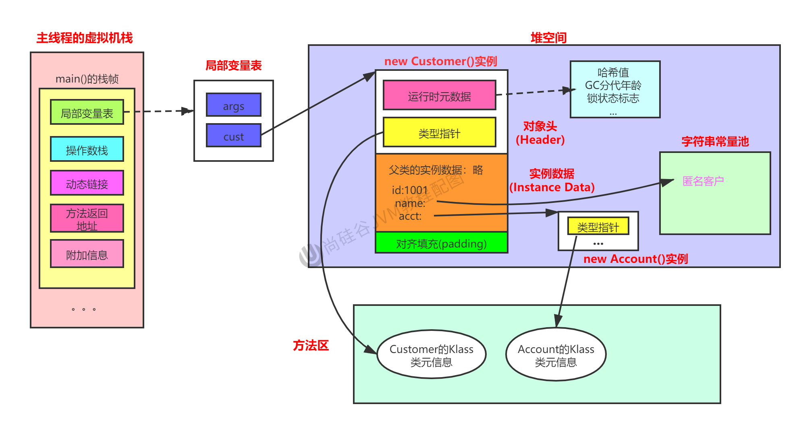


### 对象的访问定位

**JVM 是如何通过栈帧中的对象引用访问到其内部的对象实例的呢**

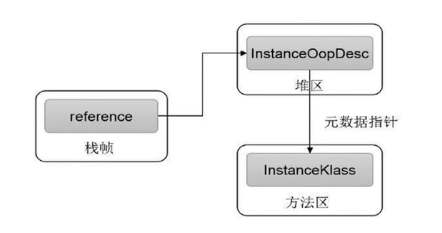

定位，通过栈上 reference 访问


对象访问方式主要有两种：

-  句柄访问

   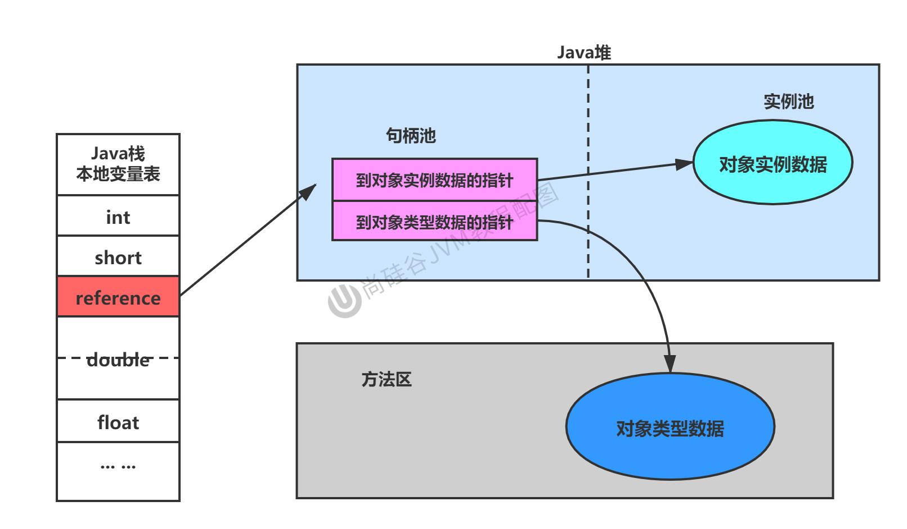

  

- 直接指针

  

  

## 直接内存

### 概述

- 不是虚拟机运行时数据区的一部分，也不是《Java虚拟机规范》中定义的内存区域

- 直接内存是在 Java 堆外的、直接向系统申请的内存区间

- 来源于 NIO， 通过存在堆中的 DirectByteBuffer 操作 Native 内存

  | IO              | NIO （New IO / Non-Blocking IO) |
  | --------------- | ------------------------------- |
  | byte[] / char[] | Buffer                          |
  | Stream          | Channel                         |

- 通常，访问直接内存的速度会优于 Java 堆。即读写性能高。

  - 因此出与性能考虑，读写频繁的场合可能会考虑使用直接内存。
  - Java 的NIO库允许 Java程序使用直接内存，用于数据缓冲区。

- 也可能导致 OOM 异常

- 由于直接内存在 Java 堆外，因此它的大小不会直接受限于 -Xmx 只当的最大堆大小，但是系统内存是优先的，Java 堆和直接内存的总和依然受限于操作系统能给出的最大内存

- 缺点

  - 分配回收成本高
  - 不受 JVM 内存回收管理

- 直接内存大小可以通过 MaxDirectMemorySize 设置

- 如果不指定，默认与堆的最大值 -Xmx 参数值一致

**简单代码示例**

```java
public class BufferTest {

    /**
     * 1GB
     */
    private static final int BUFFER = 1024 * 1024 * 1024;

    public static void main(String[] args) {
        ByteBuffer byteBuffer = ByteBuffer.allocateDirect(BUFFER);
        System.out.println("直接内存分配完毕，请求指示！");

        //
        Scanner scanner = new Scanner(System.in);
        scanner.next();

        System.out.println("直接内存开始释放");
        byteBuffer = null;
        System.gc();
        scanner.next();

    }
}

```

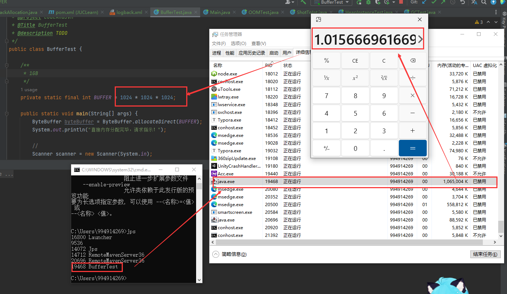

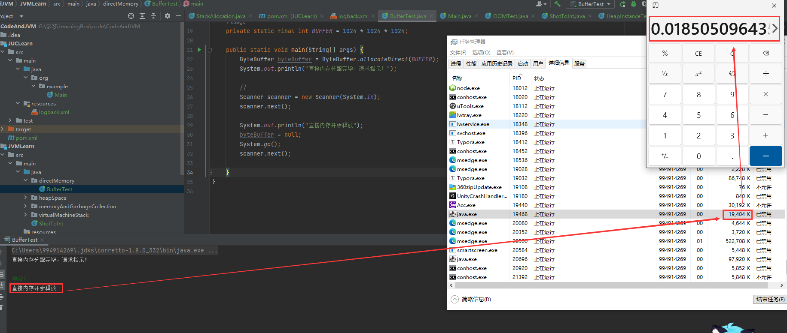

### 缓冲区

**非直接缓冲区**

读写文件，需要与磁盘交互，需要由用户态切换到内核态，在内核态时，需要内存如右图的操作。

使用 IO，见下图。这里需要两份内存存储重复数据，效率低。

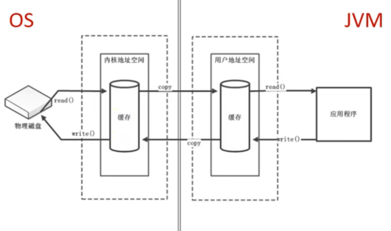

**直接缓冲区**

使用 NIO 时，如图。操作系统划出的直接缓存去可以被 java 代码直接访问，只有一份。NIO适合对大文件的读写操作。

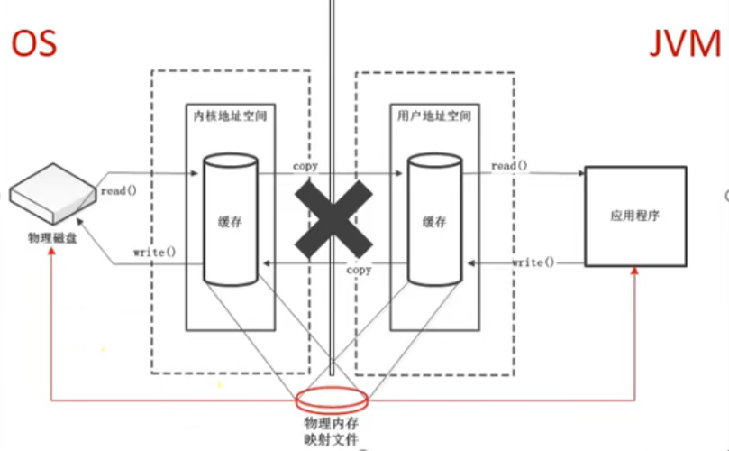

## 执行引擎

### 概述

- 执行引擎是 Java 虚拟机核心的组成部分之一。
- `虚拟机` 是一个相对于 `物理机`  的概念，这两种及其都有代码执行能力，其区别是物理机的执行引擎是直接建立在处理器、缓存  、指令集和操作系统层面上的，而**虚拟机的执行引擎是由软件自行实现的** ，因此可以不受物理条件制约地定制指令集和执行引擎则是由软件自行实现的， 因此可以不受物理条件制约地定制指令集与执行引擎地结构体系，**能够执行那些不被硬件直接支持地指令集格式**
- JVM 的主要任务是负责 **装载字节码到其内部**，但字节码并不能够直接运行在操作系统之上，因为字节码指令并非等价于本地及其指令，它内部包含的仅仅知识一些能够被 JVM 所识别的字节码指令、符号集，以及其他辅助信息。
- 那么，如果想要让一个 Java 程序运行起来，执行引擎（Execution Engine）的任务就是 **将字节码指令解释/编译为对应平台上的本地及其指令才可以。**简单来说，JVM的执行引擎充当了将高级语言翻译为及其语言的译者

### 执行引擎工作过程

1. 执行引擎在执行的过程中究竟需要执行什么样的字节码指令完全依赖于 PC 寄存器。

2. 每当执行完一项指令操作后，PC 寄存器就会更新下一条需要被执行的指令地址。

3. 当然方法在执行的过程中，执行引擎有可能会通过存储在局部变量表中的对象引用准确定位到存储在 Java 堆区中的对象实例信息，以及通过对象头中的元数据指针定位到目标对象的类型信息

   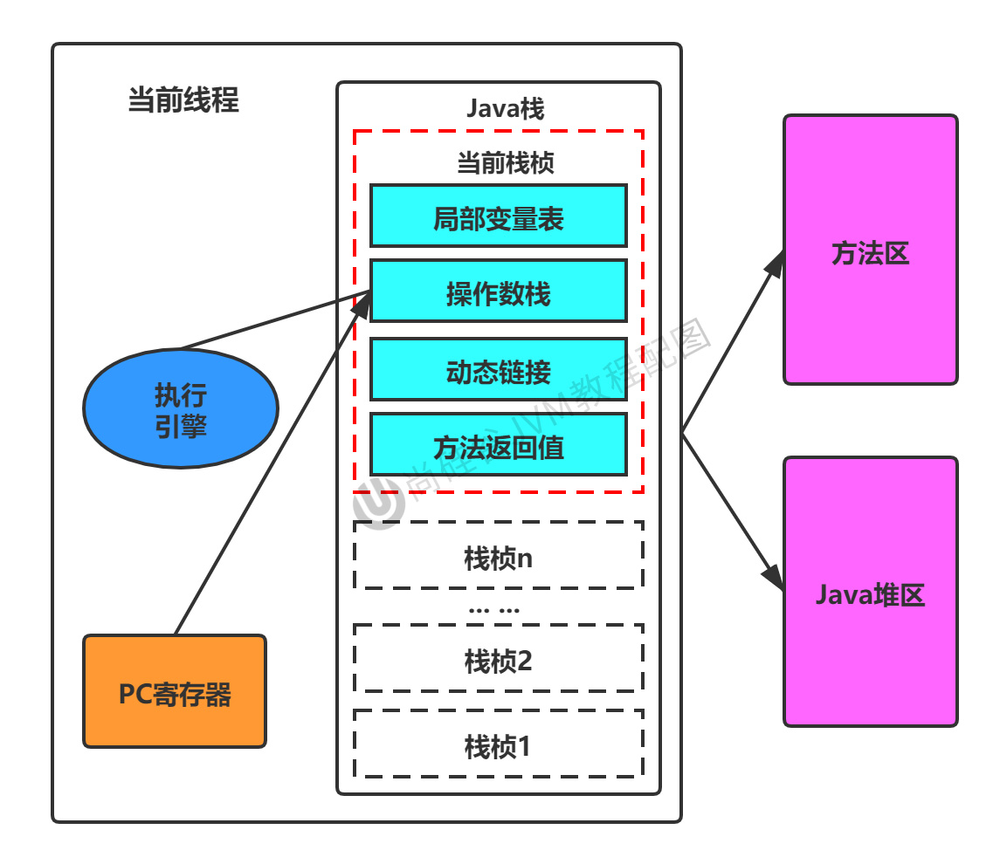

   从外观上来看，所有的 Java 虚拟机的执行引擎输入、输出都是一致的：输入的是字节码二进制流，处理过程是字节码解析执行的等效过程，输出的是执行结果。 
